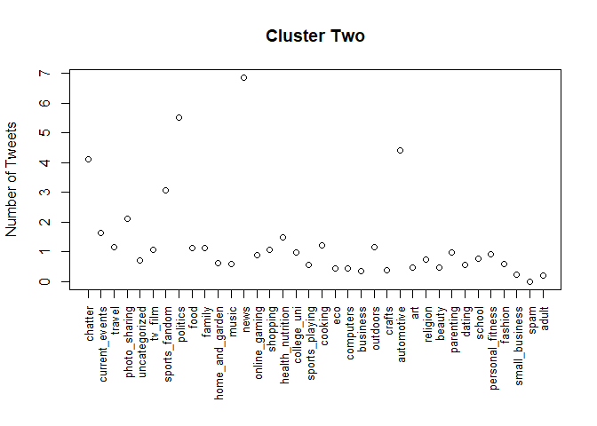
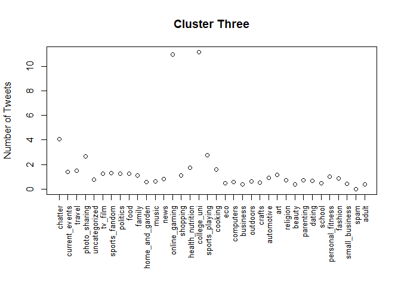

SDS 323: Exercises 03
================

## 1\) Predictive Model Building: Green Buildings

The objective of this problem was to build a predictive model for rental
income price based on the given dataset. The dataset that this model
investigated included 7,894 commercial rental properties across the
United States, of which, 685 were either LEED or EnergyStar green
building certified. The dataset included a variety of building
properties and features such as size, leasing rate, age, utilities
costs, etc.

To build a predictive model for this problem, we started with a baseline
linear regression model, as shown below.

    ##       (Intercept)              size           empl_gr      leasing_rate 
    ##     -7.753890e+00      6.720071e-06      6.098580e-02      8.846159e-03 
    ##           stories               age         renovated           class_a 
    ##     -3.679639e-02     -1.276741e-02     -2.156037e-01      2.853648e+00 
    ##           class_b      green_rating               net         amenities 
    ##      1.182268e+00      6.708819e-01     -2.532352e+00      5.889598e-01 
    ##       cd_total_07        hd_total07       total_dd_07     Precipitation 
    ##     -1.339425e-04      5.396404e-04                NA      4.430014e-02 
    ##         Gas_Costs Electricity_Costs      cluster_rent 
    ##     -3.399589e+02      1.932756e+02      1.008270e+00

The baseline linear regression model includes all features in the
dataset except the property’s ID number, the type of green certification
it received, and the cluster the property was in. We removed the
property ID number because these do not provide insight into the general
dataset, rather they are discrete numbers assigned to properties. We
elected to produce a model for green certification in general; thus, the
individual type of green certification does not necessarily matter. We
also disregarded the cluster numbers because they are not a meaningful
variables for the regression model. The significance of the clusters
were taken account for in other variables such as cluster\_rent.

We also considered another linear regression model that utilized
stepwise feature selection. We started with all main features and their
2-way interactions and executed forward/backward (both) stepwise AIC
feature selection. The stepwise linear regression model coefficients are
shown below.

    ## lm(formula = Rent ~ size + empl_gr + leasing_rate + stories + 
    ##     age + renovated + class_a + class_b + green_rating + net + 
    ##     amenities + cd_total_07 + hd_total07 + Precipitation + Gas_Costs + 
    ##     Electricity_Costs + cluster_rent + size:cluster_rent + size:Precipitation + 
    ##     stories:cluster_rent + net:cd_total_07 + size:leasing_rate + 
    ##     green_rating:amenities + hd_total07:Precipitation + age:cluster_rent + 
    ##     age:class_b + age:class_a + leasing_rate:cluster_rent + cd_total_07:cluster_rent + 
    ##     Precipitation:Gas_Costs + renovated:Precipitation + age:Electricity_Costs + 
    ##     renovated:Gas_Costs + stories:renovated + size:renovated + 
    ##     size:cd_total_07 + stories:amenities + amenities:Precipitation + 
    ##     amenities:Gas_Costs + class_b:Precipitation + class_b:Electricity_Costs + 
    ##     class_a:cluster_rent + renovated:cluster_rent + renovated:hd_total07 + 
    ##     cd_total_07:Precipitation + class_a:amenities + amenities:hd_total07 + 
    ##     Electricity_Costs:cluster_rent + renovated:Electricity_Costs + 
    ##     renovated:cd_total_07 + age:cd_total_07 + age:renovated + 
    ##     amenities:cluster_rent + class_a:Precipitation + class_a:Electricity_Costs + 
    ##     empl_gr:class_b + stories:Gas_Costs + class_b:hd_total07 + 
    ##     leasing_rate:Precipitation + class_a:hd_total07 + stories:age + 
    ##     size:age + size:class_a + age:green_rating + size:Electricity_Costs + 
    ##     size:hd_total07 + stories:Electricity_Costs, data = greenbuildings)

    ##                    (Intercept)                           size 
    ##                  -3.084249e+01                  -1.895825e-05 
    ##                        empl_gr                   leasing_rate 
    ##                   1.046989e-01                  -6.277115e-02 
    ##                        stories                            age 
    ##                  -6.461606e-02                   1.946895e-02 
    ##                      renovated                        class_a 
    ##                  -5.998079e+00                   2.116325e+01 
    ##                        class_b                   green_rating 
    ##                   2.007981e+01                   1.239214e+00 
    ##                            net                      amenities 
    ##                  -3.719374e+00                  -1.698119e-01 
    ##                    cd_total_07                     hd_total07 
    ##                   2.071035e-03                   2.497870e-03 
    ##                  Precipitation                      Gas_Costs 
    ##                   7.738041e-01                   5.106208e+02 
    ##              Electricity_Costs                   cluster_rent 
    ##                   2.472945e+02                   8.186226e-01 
    ##              size:cluster_rent             size:Precipitation 
    ##                   6.082174e-07                  -1.968606e-07 
    ##           stories:cluster_rent                net:cd_total_07 
    ##                  -4.902770e-03                   1.085562e-03 
    ##              size:leasing_rate         green_rating:amenities 
    ##                   9.781801e-08                  -2.078601e+00 
    ##       hd_total07:Precipitation               age:cluster_rent 
    ##                  -5.932347e-05                  -2.868601e-03 
    ##                    age:class_b                    age:class_a 
    ##                  -3.692964e-02                  -2.643982e-02 
    ##      leasing_rate:cluster_rent       cd_total_07:cluster_rent 
    ##                   1.612536e-03                  -4.135371e-05 
    ##        Precipitation:Gas_Costs        renovated:Precipitation 
    ##                  -2.743632e+01                   9.792677e-02 
    ##          age:Electricity_Costs            renovated:Gas_Costs 
    ##                   1.994184e+00                  -5.192464e+02 
    ##              stories:renovated                 size:renovated 
    ##                  -2.072031e-01                   7.359122e-06 
    ##               size:cd_total_07              stories:amenities 
    ##                  -1.750557e-09                   1.132272e-01 
    ##        amenities:Precipitation            amenities:Gas_Costs 
    ##                  -9.475577e-02                   4.617372e+02 
    ##          class_b:Precipitation      class_b:Electricity_Costs 
    ##                  -1.453556e-01                  -3.088666e+02 
    ##           class_a:cluster_rent         renovated:cluster_rent 
    ##                  -5.473208e-02                   7.634128e-02 
    ##           renovated:hd_total07      cd_total_07:Precipitation 
    ##                   6.174126e-04                  -4.557269e-05 
    ##              class_a:amenities           amenities:hd_total07 
    ##                  -1.048037e+00                  -3.681478e-04 
    ## Electricity_Costs:cluster_rent    renovated:Electricity_Costs 
    ##                   3.992794e+00                   1.233421e+02 
    ##          renovated:cd_total_07                age:cd_total_07 
    ##                   9.558937e-04                  -1.018630e-05 
    ##                  age:renovated         amenities:cluster_rent 
    ##                   1.587855e-02                  -4.109201e-02 
    ##          class_a:Precipitation      class_a:Electricity_Costs 
    ##                  -1.014317e-01                  -2.680635e+02 
    ##                empl_gr:class_b              stories:Gas_Costs 
    ##                  -7.534432e-02                   1.782246e+01 
    ##             class_b:hd_total07     leasing_rate:Precipitation 
    ##                  -6.815226e-04                   8.187387e-04 
    ##             class_a:hd_total07                    stories:age 
    ##                  -6.353208e-04                   2.471052e-03 
    ##                       size:age                   size:class_a 
    ##                  -1.132036e-07                  -6.216895e-06 
    ##               age:green_rating         size:Electricity_Costs 
    ##                   3.755383e-02                   4.299117e-04 
    ##                size:hd_total07      stories:Electricity_Costs 
    ##                   6.811377e-10                  -4.380302e+00

    ## [1] 68

We conducted a train/test split and iterated that process 100 times to
build an average RMSE for the predictions made by both the baseline and
stepwise linear regression models. The RMSE are shown below, where the
first column represents the RMSE for the baseline model and the second
column the stepwise predictive model.

    ##       V1       V2 
    ## 15.24128 15.18257

We observed that both these 2 predictive models yielded very similar
RMSE, with the stepwise feature selected model producing slightly better
results. We continued to explore other regularization techniques to
mimimize feature selection and improve predictive accuracy and
interpretability. We initially split our data into train and test
splits, then we continued to split the data into our feature and target
set. We did this by encoding our feature set into a model.matrix
function and applied log transform to our response variable to form the
target set.

Next, we performed cross-validation with 10-fold CV and disregarding the
main features we wanted to include in the model. We want to conduct CV
to identify the optimal value for our penalization coefficient, lambda.
The results of the 10-fold CV mean squared error across different lambda
values is shown below.

<!-- -->

This plot illustrates that we do not see substantial increase in our MSE
until lambda begins to approach \> -8. We extracted our one standard
error MSE and the corresponding lambda value, which are shown below.

    ## [1] 0.06121604

    ## [1] 0.000286201

We do not want to necessarily select the lambda with the minimum MSE.
The lambda that drives the minimum MSE may reduce the features down, but
there will be variability in the MSE. Thus, using the lambda that drives
1 standard deviation away from the minimum MSE allows us to further
reduce the number of features included while yielding similar MSE. We
see below a list of all the remaining features and their associated
coefficients.

    ##                      intercept                           size 
    ##                   2.164601e+00                  -1.408850e-07 
    ##                        empl_gr                   leasing_rate 
    ##                   1.590613e-03                   1.728681e-04 
    ##                        stories                            age 
    ##                   5.714058e-04                  -1.016275e-03 
    ##                      renovated                        class_a 
    ##                  -6.870162e-02                   1.472328e-01 
    ##                        class_b                   green_rating 
    ##                   9.501614e-02                   5.659778e-02 
    ##                            net                      amenities 
    ##                  -1.169734e-01                   3.118371e-02 
    ##                    cd_total_07                     hd_total07 
    ##                  -5.193449e-05                  -2.747951e-05 
    ##                    total_dd_07                  Precipitation 
    ##                  -4.121865e-06                   4.920716e-04 
    ##                      Gas_Costs              Electricity_Costs 
    ##                  -7.611580e+00                   1.163941e+01 
    ##                   cluster_rent                   size:empl_gr 
    ##                   4.317427e-02                   5.231899e-09 
    ##              size:leasing_rate                   size:stories 
    ##                   2.272227e-09                  -5.341727e-10 
    ##                       size:net               size:cd_total_07 
    ##                  -1.112660e-09                  -1.625708e-11 
    ##              size:cluster_rent                empl_gr:class_a 
    ##                   2.094545e-09                   4.211840e-04 
    ##                    stories:age              stories:renovated 
    ##                   2.086579e-05                  -9.355142e-04 
    ##                stories:class_b            stories:cd_total_07 
    ##                   9.657655e-04                  -4.428257e-07 
    ##                  age:renovated                    age:class_b 
    ##                   9.893767e-04                  -5.656341e-04 
    ##                age:cd_total_07                  renovated:net 
    ##                  -2.133346e-07                  -1.301087e-02 
    ##           renovated:hd_total07         renovated:cluster_rent 
    ##                   2.726579e-06                   8.695516e-04 
    ##           class_a:cluster_rent              class_b:amenities 
    ##                  -5.802947e-04                   5.499603e-03 
    ##              class_b:Gas_Costs         green_rating:amenities 
    ##                  -1.413828e+00                  -3.864525e-02 
    ##                net:cd_total_07          amenities:cd_total_07 
    ##                   4.250798e-05                   5.353073e-06 
    ##         cd_total_07:hd_total07       total_dd_07:cluster_rent 
    ##                  -3.279264e-10                   6.934503e-07 
    ##     Precipitation:cluster_rent Electricity_Costs:cluster_rent 
    ##                  -3.268064e-06                  -4.516589e-01

Now, we applied the optimal lambda identified through cross validation
to our regression model. Below, we produce the results for the RMSE and
R^2 of the predictions for the test split of the data, as well as a plot
of the model.

    ## Warning in predict.lm(lm_base, green_test, na.action = na.exclude): prediction
    ## from a rank-deficient fit may be misleading

    ##       RMSE   Rsquare
    ## 1 0.234258 0.7351013

<!-- -->

To provide some visual assessment of the lasso regression, below is a
plot describing every feature and interaction remaining in the
regression model. The other features and interactions were forced toward
0 as a result of the penalty parameter. The features included in the
model are marked as blue/green data points while those not included in
the model are red. The x-axis shows the corresponding coefficient value.

<!-- -->

All in all, we compare the RMSE and Rsquare values of the different
regression models we explored in the table below. The first row is the
baseline regression, the second the stepwise selection, and the last
being the lasso regression. Observe that the lasso regression produces a
model that more acccurately predicts results, uses less features (more
interpretable), and has stronger precision.

    ##       RMSE   Rsquare
    ## 1 8.547448 0.6730511
    ## 2 8.673799 0.6633135
    ## 3 0.234258 0.7351013

Now, the next aspect of the problem asked to investigate how our model
predicts the average change in rental income per square foot (absolute
or percentage terms) associated with green certification. In order to
conduct this analysis, our general pipeline was to first subset the
greenbuildings.csv dataset into green and non-green buildings only
first. Next, we would continue to follow the same procedures shown above
for lasso regression for both the green buildings dataset and non-green
buildings dataset. Lastly, we would calculate the average rent ($/sqft)
from our predictions for green and non-green buildings and make
comparisons.

After running our lasso regression model, we transformed the predicted
results for rent back to true values as they were previously transformed
to a log scale during regression. The average rent ($/sqft) for green
and non-green buildings are shown below.

``` r
avg_green = sum(green_predictions)/dim(green_predictions)[1]
avg_green
```

    ## [1] 29.81532

``` r
avg_not_green = sum(not_green_predictions)/dim(not_green_predictions)[1]
avg_not_green
```

    ## [1] 27.42687

Next, we used these mean rent values to determine a percentage
difference between the two categories of buildings. We observe that on
average, there was approximately a 5.00% to 6.00% higher rent for green
buildings than non-green buildings.

``` r
percentage_diff = (avg_green/avg_not_green - 1) * 100
percentage_diff
```

    ## [1] 8.708447

However, this does not tell much about the total building revenue. To
put this percentage difference into context, we pursued to find the
average size of both green and non-green buildings (sqft). Then, we
multiplied those average sizes by the average leasing rate of the
building, which would effectively return the amount of square footage
capable of returning revenue.

``` r
avg_occupied_green = sum(green[3])/dim(green[3])[1] * sum(green[6])/dim(green[6])[1]/100
avg_occupied_notgreen = sum(not_green[3])/dim(not_green[3])[1] * sum(not_green[6])/dim(not_green[6])[1]/100

avg_rev_green = avg_occupied_green * avg_green
avg_rev_notgreen = avg_occupied_notgreen * avg_not_green
perecentage_diff_rev = (avg_rev_green/avg_rev_notgreen - 1) * 100
perecentage_diff_rev
```

    ## [1] 70.69558

In conclusion, we observe that green buildings on average yield
approximately 65.4% higher revenues for their occupied leasing space
than non-green buildings.

In this problem, we investigated different methods and techniques for
predicting building rental income. We started with a basic linear
regression model which included almost all features and interactions,
minus the ones that were merely labels or provided no meaningful insight
to the rent. We then applied stepwise feature selection in an attempt to
identify which features and interactions contirbute the most in
predicting accurate rental prices. Lastly, we applied a lasso regression
and cross-validation to reduce the number of features and produce a more
accurate predictive model. We compared the RMSE of each regression
method and found that our results supported the conclusion that the
lasso regression model allowed the best balance between interpretability
and accuracy. Once we honed in on our best model selection, we applied
our regression model specifically to only green and non-green buidlings
and found that the average rent in $/sqft for green buildings was 5-6%
higher than non-green buildings. After calculating the approximate
average, capitalizable real estate (sqft) for green and non-green
buildings, we discovered that green buildings on average reap greater
than 65% rental income than non-green buildings.

## 2\) What Causes What? (Planet Money Podcast)

#### A) Why can’t I just get data from a few different cities and run the regression of “Crime” on “Police” to understand how more cops in the streets affect crime? (“Crime” refers to some measure of crime rate and “Police” measures the number of cops in a city.)

###### Confounding Variables:

The main flaw in this approach has to do with the presence of many
confounding variables. In other words, there might be plenty of factors
that also influence the crime rates that coincidentally occur when more
cops are in the streets. Other variables such as the time of week,
month, or year, or even the sizes of the city, the mean socioeconomic
status of its residents, and level of tourism may all influence both the
crime rate and/or the number of police in the city. These other
variables cause feature interactions and should also be taken account
for in a regression model. Thus, running a regression of “Crime” on
“Police” would make a poor predictive model. The podcast mentions some
examples, such as the possibility that crime rates reduce because
criminals are afraid of increased potential terrorism activity (since it
is an alert day) so they are less likely to go outside, or even the fact
that more cops just happen to be out during bad weather days
(rainy/stormy) in order to assist any citizens in need. As we have
shown, one cannot simply infer that more cops on the streets leads to
lower crime rates.

###### Representative Sampling:

For starters, you would have to choose “a few different cities” that are
representative of other cities around the country. If you are from the
United States, you know this would likely be next to impossible, as many
cities are significantly different in terms of size, population,
geography, and much more. Again, these differences can largely
contribute to the observed results.

###### Correlation **IS NOT** Causation:

Finally, the golden rule. Although a regression can provide meaningful
insight, it does not necessarily determine a causal relationship between
the variables, only correlations. This is due the the reasons mentioned
above.

#### B) How were the researchers from UPenn able to isolate this effect? Briefly describe their approach and discuss their result in the “Table 2” below, from the researchers’ paper.


In summary, Table 2 shows the results for the investigators’ most basic
regression where they looked at daily crime totals versus terror alert
level. The investigators hypothesized that crime fell during high-alert
days due to a greater presence of police in the public. However, another
potential theory could be that the target audience of crimes could be
reduced during high-alert days. For example, tourism is reduced on
high-alert days; thus, the number of potential victims is reduced,
leading to fewer crimes. Consequently, the researchers from UPenn wanted
to test whether fewer visitors could explain their results, so they
acquired daily data on public transportation (Metro) ridership. The
researchers included logged mid-day Metro ridership directly into the
regression. The coefficient at high-alert days shrinks slightly to 6
crimes per day instead of 7. We see in row 2 that a 10% increase in
Metro ridership increases the number of crimes by about 1.7 per day on
average. Thus, if we assume that Metro ridership gives a good
approximation for the number of daily visitors at a given day, then the
changes in number of visitors cannot explain a general change in crime
rate. Both regressions produce similar coefficients of determination of
.14 and .17 respectively. This hints at relatively low correlations.

#### C) Why did they have to control for Metro ridership? What was that trying to capture?

The researchers find that increased Metro ridership is correlated with
an increase in crime. However, the change associated with ridership
appears to be insignificant (a 10% increase in Metro ridership increases
the number of crimes by only 1.7 per day on average). Therefore, even
though Metro ridership appears to be a good proxy for tourism, changes
in the number of tourists cannot necessarily explain the systematic
change in crime that we estimate. (according to the research)

In column ii of Table 2 we verify that high alert levels are not being
confounded with tourism levels by including logged mid-day Metro
ridership directly in the regression. The researchers were using Metro
ridership as a proxy for estimating the number of tourist visitors at
the National Mall. Because tourist visitors may be a target audience for
crimes, a greater number of visitors on a given day may imply more
crimes. However, the researchers from UPenn did not necessarily believe
that increased tourist visitors would lead to more crimes observed,
because they did not expect daily crime to vary by a statistically
significant amount with the number of daily visitors. Thus, the
investigators wanted to verify by including logged midday ridership in
their regression model and measuring how much their regression
coefficient for crime and police changed. The purpose of this was to
test whether fewer visitors could explain the results obtained in the
daily data on public transportation. Metro ridership had to be
controlled because it had no impact on the crime rates. The researchers
found that even when accounting for ridership rates, crime rates did not
significantly change. Adding a variable to represent the Metro ridership
only changes the crime rate for the high alert variable from -7.316 to
-6.046 which is not a significant change, and therefore crime rates do
not change by a meaningful amount as this variable changes. If there was
a significant change, it would need to be accounted for in the analysis.

#### D) Below I am showing you “Table 4” from the researchers’ paper. Just focus on the first column of the table. Can you describe the model being estimated here? What is the conclusion?


The first column represents a robust model controlling for ridership as
well as differences between districts. The model here is attempting to
account for the differences accross districts, especially controlling
for District 1 (known as the National Mall) because it is where the
White House, Congress, the Smithsonian and many other prominent
government agencies and public areas of Washington are located.
Therefore, the assumption was made that all of the increased protection
falls on District 1. According to the research, during high-alert
levels, crime in the National Mall area falls by 2.62 crimes per day.
Crime also falls in the other districts, by 0.571 crimes per day but
this effect is not statistically significant. The research finds that
almost one half (43.6%) of the total crime drop during highalert periods
is concentrated in District 1, the National Mall area. The difference
between the High Alert x District One and the High Alert x Other
Districts coefficients controls for all common factors between the
districts. This includes factors such as weather, tourism, or other
events that affect the districts similarly. There still remains an issue
with the introduction of confounding variables. If bad weather, for
example, causes decreases in crime, a coincidental correlation with
high-alert timing could confound our results. Since the cameras are more
active and cover more area in District 1 on high alert days, that also
may be a reason for higher reported crimes compared to days where there
is no alert and therefore less camera activity. Even after controlling
for all such factors, it still suggests that crime falls in District 1
during high-alert periods by about 2 crimes per day or more than 12
percent.

To summarize, the first column from Table 4 shows the results of their
regression model. However, the column includes coefficients for the
relationship between crime and police presence for District 1 (National
Mall) and all the other districts. The researchers are summarizing their
linear regression model. The rate at which crimes decrease (the slope or
beta) in District 1 is by approximately 2.6 crimes per day and in Other
Districts is by 0.571 crimes per day. We see that of the total crime
drop during high-alert periods, a vast majority of the decrease in crime
can be found in District 1 (National Mall). Thus, the conclusion is that
most of the increased police presence leads to a decreased crime rates
in District 1 because that is where the White House, Congress, and major
political establishments reside.

## 3\) Clustering & Principal Component Analysis (PCA): Wine

#### Data Exploratory Analysis

The objective of this problem was to use both PCA and k-means to reduce
dimensionality in an attempt to identify clusters of wine, perhaps by
the color (white or red). The dataset provided 11 different features
that described the chemical properties of wine, including a wide variety
of characteristics such as fixed acidity, residual sugar, free sulfur
dioxide, etc. Additionally, a quality rating for each wine (scale of
1-10) and a color label for the wine were also included in the dataset.
Below, observe the mean quality rating for the white and red wines,
respectively. Using the quality variable, we can compare the average
ratings of both white and red wines to determine a preference among the
“certified” judges.

``` r
# White Wine Average Rating
white = subset(wine, color == 'white')
mean(white$quality)
```

    ## [1] 5.877909

``` r
# Red Wine Average Rating
red = subset(wine, color == 'red')
mean(red$quality)
```

    ## [1] 5.636023

As shown, white wine received a higher average rating of about 5.88
whereas red wine received an average rating of about 5.64. This shows an
insignificant difference between the ratings for the two types of wine.

Next, we can plot some of the variables against each other to observe
chemical properties that potentially differ between red and white wine.
Some of these variables that appear to have an impact include:
Sulphates, Chlorides, Total Sulfur Dioxide, as well as both Fixed &
Volatile Acidity.

<!-- -->

As you can see, there appears to be a difference between the two wine
colors regarding these spcific chemical properties.

#### PCA Analysis

First, we wanted to apply some technique of dimensionality reduction to
the dataset to make our analysis more interpretable. Principle
components analysis allow us to go from 11 features to looking at a few
principle component summaries that take into account a wide majority of
the variance in the data. Thus, we would be able to more easily cluster
the data and visualize it for just the few principle components we
select.

As you can see, we collected the principle components and plotted the
proportion of variance contributed against the principle component. We
also plotted the cumulative proportion of variance against the number of
principle components. We aimed to select the principle components with
standard deviations of at least 1, but in general, we wanted to simply
include enough principle components to cover a significant amount of the
variance in the data while maintaining a simple model.

    ## Importance of components:
    ##                           PC1    PC2    PC3     PC4     PC5     PC6     PC7
    ## Standard deviation     1.7407 1.5792 1.2475 0.98517 0.84845 0.77930 0.72330
    ## Proportion of Variance 0.2754 0.2267 0.1415 0.08823 0.06544 0.05521 0.04756
    ## Cumulative Proportion  0.2754 0.5021 0.6436 0.73187 0.79732 0.85253 0.90009
    ##                            PC8     PC9   PC10    PC11
    ## Standard deviation     0.70817 0.58054 0.4772 0.18119
    ## Proportion of Variance 0.04559 0.03064 0.0207 0.00298
    ## Cumulative Proportion  0.94568 0.97632 0.9970 1.00000

Standard deviation: these are the eigenvalues in our case since the data
has been centered and scaled (standardized)

Proportion of Variance: this is the amount of variance the component
accounts for in the data, ie. PC1 accounts for \>27% of total variance
in the data alone

Cumulative Proportion: This is simply the accumulated amount of
explained variance, ie. if we used the first 10 components we would be
able to account for \>99% of total variance in the data.

Since an eigenvalue \< 1 would mean that the component actually explains
less than a single explanatory variable, we will utilize the first three
principal components. This is shown below:
<!-- -->

The fourth prinicpal component falls just below the threshold, so it has
potential to also provide some meaningful results. However, for the
following analysis, we will not include it.

Through these first three principal components, we are able to preserve
about 64% of the variance (pretty good). This means that we can
effectively reduce dimensionality from 11 to 3 while only losing about
36% of variance.

<!-- -->

Now we can visually assess these principal components against each other
to get an idea of how the data could potentially be clustered.


There are clearly some distinct patterns among these principal
components, so we will take it a step further to get an idea as to the
identification of these clusters in context. If you remember, we would
like to explain the difference between red and white wines.

<!-- -->

With just the first two components, we can clearly see some separation
between the white and red wines. This could also be analyzed using PC1 &
PC3 as well as PC2 & PC3 as shown previously. With this in mind, we will
now perform a clustering algorithm (kmeans) to obtain further insights
as to the grouping of these wines.

#### K-Means

After conducting a principle components analysis, we were able to
identify the first 3 principle components to have encompassed a majority
of the variance in the dataset (approximately 63%). Thus, instead of
clustering against 11 dimensions, we were able to reduce the data to 3
dimensions and apply K-means clustering, while still capturing a
majority of the variance in the data. We applied 2 clusters as our input
to predict the difference between red and white wines.

``` r
input <- wine[c(1:11)]
# Extract the centers and scales from the rescaled data (which are named attributes)
X = scale(input, center=TRUE, scale=TRUE)
# Center and scale the data
mu = attr(X,"scaled:center")
sigma = attr(X,"scaled:scale")
# Run k-means with 2 clusters and 25 starts
clust = kmeans(X, centers=2, nstart=25)
```

We can observe some of the summary metrics of our k-means analysis as
follows:

###### Centers:

``` r
clust$centers*sigma + mu
```

    ##   fixed.acidity volatile.acidity citric.acid residual.sugar chlorides
    ## 1     8.2895922         0.488347  0.04419919     82.3745298 3.3666960
    ## 2     0.2934882         3.562436 32.55483692      0.9952959 0.4848445
    ##   free.sulfur.dioxide total.sulfur.dioxide    density        pH sulphates
    ## 1            9.499931            0.1442033 8.68591321  40.59506 0.9972247
    ## 2            7.580235            0.3770308 0.04795184 104.89060 3.1726187
    ##      alcohol
    ## 1  0.5200048
    ## 2 10.5223589

These are the locations of the centers for both clusters, representing
the average chemical properties for each cluster of wines.

###### Within-Cluster Sum of Squares (for each cluster):

``` r
clust$withinss
```

    ## [1] 18434.47 37700.81

This metric measures the squared average distance of all the points
within a cluster to the cluster centroid. We would like this value to be
relatively low, meaning that the clusters are compact.

###### Total Within-Cluster Sum of Squares, i.e. sum(withinss):

``` r
clust$tot.withinss
```

    ## [1] 56135.28

###### The Between-Cluster Sum of Squares, i.e. totss-tot.withinss:

``` r
clust$betweenss
```

    ## [1] 15320.72

This metric measures the squared average distance between all centroids.
We would like this value to be relatively high, meaning that the
clusters are clearly separated from each other.

###### The number of data points in each cluster:

``` r
clust$size
```

    ## [1] 1643 4854

Now, we can pull points from each cluster to determine an overall trend
for each cluster to see if we successfully separated the two wines
according to their chemical properties.

###### Cluster One

Here is the first few index values for some of the wines that fell in
the first cluster.

    ## [1] 1 2 3 4 5 6

We can use these values to pull the chemical properties of these
specific wines to assess the similarities.

    ## # A tibble: 1 x 13
    ##   fixed.acidity volatile.acidity citric.acid residual.sugar chlorides
    ##           <dbl>            <dbl>       <dbl>          <dbl>     <dbl>
    ## 1           7.4              0.7           0            1.9     0.076
    ##   free.sulfur.dioxide total.sulfur.dioxide density    pH sulphates alcohol
    ##                 <dbl>                <dbl>   <dbl> <dbl>     <dbl>   <dbl>
    ## 1                  11                   34   0.998  3.51      0.56     9.4
    ##   quality color
    ##     <dbl> <chr>
    ## 1       5 red

    ## # A tibble: 1 x 13
    ##   fixed.acidity volatile.acidity citric.acid residual.sugar chlorides
    ##           <dbl>            <dbl>       <dbl>          <dbl>     <dbl>
    ## 1           7.8             0.88           0            2.6     0.098
    ##   free.sulfur.dioxide total.sulfur.dioxide density    pH sulphates alcohol
    ##                 <dbl>                <dbl>   <dbl> <dbl>     <dbl>   <dbl>
    ## 1                  25                   67   0.997   3.2      0.68     9.8
    ##   quality color
    ##     <dbl> <chr>
    ## 1       5 red

    ## # A tibble: 1 x 13
    ##   fixed.acidity volatile.acidity citric.acid residual.sugar chlorides
    ##           <dbl>            <dbl>       <dbl>          <dbl>     <dbl>
    ## 1           7.8             0.76        0.04            2.3     0.092
    ##   free.sulfur.dioxide total.sulfur.dioxide density    pH sulphates alcohol
    ##                 <dbl>                <dbl>   <dbl> <dbl>     <dbl>   <dbl>
    ## 1                  15                   54   0.997  3.26      0.65     9.8
    ##   quality color
    ##     <dbl> <chr>
    ## 1       5 red

    ## # A tibble: 1 x 13
    ##   fixed.acidity volatile.acidity citric.acid residual.sugar chlorides
    ##           <dbl>            <dbl>       <dbl>          <dbl>     <dbl>
    ## 1          11.2             0.28        0.56            1.9     0.075
    ##   free.sulfur.dioxide total.sulfur.dioxide density    pH sulphates alcohol
    ##                 <dbl>                <dbl>   <dbl> <dbl>     <dbl>   <dbl>
    ## 1                  17                   60   0.998  3.16     0.580     9.8
    ##   quality color
    ##     <dbl> <chr>
    ## 1       6 red

    ## # A tibble: 1 x 13
    ##   fixed.acidity volatile.acidity citric.acid residual.sugar chlorides
    ##           <dbl>            <dbl>       <dbl>          <dbl>     <dbl>
    ## 1           7.4              0.7           0            1.9     0.076
    ##   free.sulfur.dioxide total.sulfur.dioxide density    pH sulphates alcohol
    ##                 <dbl>                <dbl>   <dbl> <dbl>     <dbl>   <dbl>
    ## 1                  11                   34   0.998  3.51      0.56     9.4
    ##   quality color
    ##     <dbl> <chr>
    ## 1       5 red

Now we can do the same with the second cluster.

###### Cluster Two

IDs:

    ## [1]  50 355 495 592 635 650

Wines in second cluster:

    ## # A tibble: 1 x 13
    ##   fixed.acidity volatile.acidity citric.acid residual.sugar chlorides
    ##           <dbl>            <dbl>       <dbl>          <dbl>     <dbl>
    ## 1           5.6             0.31        0.37            1.4     0.074
    ##   free.sulfur.dioxide total.sulfur.dioxide density    pH sulphates alcohol
    ##                 <dbl>                <dbl>   <dbl> <dbl>     <dbl>   <dbl>
    ## 1                  12                   96   0.995  3.32     0.580     9.2
    ##   quality color
    ##     <dbl> <chr>
    ## 1       5 red

    ## # A tibble: 1 x 13
    ##   fixed.acidity volatile.acidity citric.acid residual.sugar chlorides
    ##           <dbl>            <dbl>       <dbl>          <dbl>     <dbl>
    ## 1           6.1             0.21         0.4            1.4     0.066
    ##   free.sulfur.dioxide total.sulfur.dioxide density    pH sulphates alcohol
    ##                 <dbl>                <dbl>   <dbl> <dbl>     <dbl>   <dbl>
    ## 1                40.5                  165   0.991  3.25      0.59    11.9
    ##   quality color
    ##     <dbl> <chr>
    ## 1       6 red

    ## # A tibble: 1 x 13
    ##   fixed.acidity volatile.acidity citric.acid residual.sugar chlorides
    ##           <dbl>            <dbl>       <dbl>          <dbl>     <dbl>
    ## 1           6.5             0.39        0.23            8.3     0.051
    ##   free.sulfur.dioxide total.sulfur.dioxide density    pH sulphates alcohol
    ##                 <dbl>                <dbl>   <dbl> <dbl>     <dbl>   <dbl>
    ## 1                  28                   91   0.995  3.44      0.55    12.1
    ##   quality color
    ##     <dbl> <chr>
    ## 1       6 red

    ## # A tibble: 1 x 13
    ##   fixed.acidity volatile.acidity citric.acid residual.sugar chlorides
    ##           <dbl>            <dbl>       <dbl>          <dbl>     <dbl>
    ## 1           6.6             0.39        0.49            1.7      0.07
    ##   free.sulfur.dioxide total.sulfur.dioxide density    pH sulphates alcohol
    ##                 <dbl>                <dbl>   <dbl> <dbl>     <dbl>   <dbl>
    ## 1                  23                  149   0.992  3.12       0.5    11.5
    ##   quality color
    ##     <dbl> <chr>
    ## 1       6 red

    ## # A tibble: 1 x 13
    ##   fixed.acidity volatile.acidity citric.acid residual.sugar chlorides
    ##           <dbl>            <dbl>       <dbl>          <dbl>     <dbl>
    ## 1           7.9             0.35        0.21            1.9     0.073
    ##   free.sulfur.dioxide total.sulfur.dioxide density    pH sulphates alcohol
    ##                 <dbl>                <dbl>   <dbl> <dbl>     <dbl>   <dbl>
    ## 1                  46                  102   0.996  3.27     0.580     9.5
    ##   quality color
    ##     <dbl> <chr>
    ## 1       5 red

#### Optimizing K

We see that from our principle components analysis, we were able to
capture a majority of the variance in the data through 3 principle
components. Running K-means clustering for 2 clusters allowed us to
visibly distinguish the red from the white wines.

While this is was a good start, we can now optimize K by using various
methods such as the Elbow Plot, CH Index, and even the Gap Statistic to
detemine an optimal number of clusters.

Elbow Plot:
<!-- -->

This method consists of plotting the Error Sum of Squares (SSE) against
multiple values of K (number of clusters). Typically in this method, you
chooce the number of clusters around the “elbow” of the plot, which is
the point in the plot at which we experience diminishing returns that
are not worth the additional cost (potential overfitting). In our case,
that elbow lands around K=3 or K=4. Next, we will use another method
called CH Index.

CH Index:
<!-- --> This
method uses between-cluster and within-cluster sums of squares for the k
clusters to determien an optimal value for K. Typically in this case, we
choose a value of K in which this value is maximized, FOr our case, this
is around K=2 or K=3. Finally, we will use the Gap Statistic to find an
optimal value of K.

Gap Statistic:
<!-- -->

This approach compares the total within intra-cluster variation for
different values of k with their expected values under a distribution
with no obvious clustering. Typically, we look for a dip in the chart,
which appears to be around K=5. We can take this a step further by
retrieving the information on this plot here:

    ## Clustering Gap statistic ["clusGap"] from call:
    ## clusGap(x = X, FUNcluster = kmeans, K.max = 10, B = 10, nstart = 25)
    ## B=10 simulated reference sets, k = 1..10; spaceH0="scaledPCA"
    ##  --> Number of clusters (method 'firstSEmax', SE.factor=1): 5
    ##           logW    E.logW      gap      SE.sim
    ##  [1,] 8.873237 10.169379 1.296142 0.002760268
    ##  [2,] 8.748376 10.085968 1.337592 0.002347473
    ##  [3,] 8.635368 10.029571 1.394203 0.002365304
    ##  [4,] 8.584878  9.989249 1.404371 0.002319263
    ##  [5,] 8.546191  9.958382 1.412192 0.002507159
    ##  [6,] 8.529867  9.931160 1.401292 0.002563182
    ##  [7,] 8.502676  9.912726 1.410050 0.002683872
    ##  [8,] 8.481853  9.895135 1.413282 0.002477226
    ##  [9,] 8.465635  9.883195 1.417560 0.002395451
    ## [10,] 8.451499  9.872109 1.420611 0.002573299

As you can see, the variation dips after K=5 from .0012 to about .0011,
and the output recommends 5 clusters.

In summary, we wanted to find what the optimal K value would be for our
clustering algorithm to explore how that model may compare. First, we
looked at an elbow plot, which measured the SSE versus K. In our elbow
plot, we wanted to observe the K value that gives biggest difference in
SSE. From our elbow plot, one can see that the optimal K value is
between 2 and 3. We also explored the CH index. From our CH index plot,
we see, again, the optimal K value is likely around 2 or 3. Lastly, we
also included analysis of the gap statistic, and we found that biggest
dip in the gap statistic led to an optimal K value of 5.

In conclusion, we conducted a principle components analysis to reduce
the number of dimensions in the dataset that would not lose a
statistically significant proportion of variance. We found that 3
principle components captured about 63% of the variance. Coupled with
K-means clustering with K=2 clusters, we were able to distinguish red
and white wines. However, we also explored defining the optimal K value,
which led to a variety of answers based on the statistical metric. This
likely means that there may be some similarities between the wines other
than just by color, and this makes sense. The problem also considers
different qualities of wines. A plausible hypothesis as to why more
clusters would be optimal is wines of the same quality rating may share
lots of similarities with each other than compared with wines of the
same color. Thus, with our analytical pipeline, it may be possible to
predict lower and higher quality wines. However, although though we ran
measures for optimal K-values, it does not necessarily mean that those
produce a better model than one with K=2 clusters. The optimal model may
not necessarily be the most interpretable or intuitive.

Although we received a couple of different values of K, the common
denominator seems to be about K=3. We will now run k-means using k=3
clusters (the optimal number of k according to our analysis) to see if
we can discover what the third cluster might consist of (perhaps it
identified more expensive or higher quality wines).

<!-- -->

It appears that using three clusters breaks up the previously right
cluster into two different clusters. We can pull some of these wines to
see what might be different about them.

###### Third Cluster

    ## [1]  46  50  96 132 133 143

    ## # A tibble: 1 x 13
    ##   fixed.acidity volatile.acidity citric.acid residual.sugar chlorides
    ##           <dbl>            <dbl>       <dbl>          <dbl>     <dbl>
    ## 1           4.6             0.52        0.15            2.1     0.054
    ##   free.sulfur.dioxide total.sulfur.dioxide density    pH sulphates alcohol
    ##                 <dbl>                <dbl>   <dbl> <dbl>     <dbl>   <dbl>
    ## 1                   8                   65   0.993   3.9      0.56    13.1
    ##   quality color
    ##     <dbl> <chr>
    ## 1       4 red

    ## # A tibble: 1 x 13
    ##   fixed.acidity volatile.acidity citric.acid residual.sugar chlorides
    ##           <dbl>            <dbl>       <dbl>          <dbl>     <dbl>
    ## 1           5.6             0.31        0.37            1.4     0.074
    ##   free.sulfur.dioxide total.sulfur.dioxide density    pH sulphates alcohol
    ##                 <dbl>                <dbl>   <dbl> <dbl>     <dbl>   <dbl>
    ## 1                  12                   96   0.995  3.32     0.580     9.2
    ##   quality color
    ##     <dbl> <chr>
    ## 1       5 red

    ## # A tibble: 1 x 13
    ##   fixed.acidity volatile.acidity citric.acid residual.sugar chlorides
    ##           <dbl>            <dbl>       <dbl>          <dbl>     <dbl>
    ## 1           4.7              0.6        0.17            2.3     0.058
    ##   free.sulfur.dioxide total.sulfur.dioxide density    pH sulphates alcohol
    ##                 <dbl>                <dbl>   <dbl> <dbl>     <dbl>   <dbl>
    ## 1                  17                  106   0.993  3.85       0.6    12.9
    ##   quality color
    ##     <dbl> <chr>
    ## 1       6 red

    ## # A tibble: 1 x 13
    ##   fixed.acidity volatile.acidity citric.acid residual.sugar chlorides
    ##           <dbl>            <dbl>       <dbl>          <dbl>     <dbl>
    ## 1           5.6              0.5        0.09            2.3     0.049
    ##   free.sulfur.dioxide total.sulfur.dioxide density    pH sulphates alcohol
    ##                 <dbl>                <dbl>   <dbl> <dbl>     <dbl>   <dbl>
    ## 1                  17                   99   0.994  3.63      0.63      13
    ##   quality color
    ##     <dbl> <chr>
    ## 1       5 red

    ## # A tibble: 1 x 13
    ##   fixed.acidity volatile.acidity citric.acid residual.sugar chlorides
    ##           <dbl>            <dbl>       <dbl>          <dbl>     <dbl>
    ## 1           5.6              0.5        0.09            2.3     0.049
    ##   free.sulfur.dioxide total.sulfur.dioxide density    pH sulphates alcohol
    ##                 <dbl>                <dbl>   <dbl> <dbl>     <dbl>   <dbl>
    ## 1                  17                   99   0.994  3.63      0.63      13
    ##   quality color
    ##     <dbl> <chr>
    ## 1       5 red

Conducting further analyses can help us find differences within the
third cluster and interpret results, as we did with the first two
clusters. However, for the sake of simplicity, we will simply just
compare some common metrics..

###### K=2 or K=3?

Although the difference between results for the two K values is
dependent on context, we can at least evaluate the common metrics to
compare the two models.

###### Within-Cluster Sum of Squares (for each cluster):

``` r
clust$withinss # K=2
```

    ## [1] 18434.47 37700.81

``` r
opt_clust$withinss # K=3
```

    ## [1] 11748.70 17072.86 16748.41

Remember, we would like this value to be relatively low. As you can see,
K=3 produces lower values. However, this is probably because of the way
we obtained a K values o3 (using these metrics).

###### The Between-Cluster Sum of Squares, i.e. totss-tot.withinss:

``` r
clust$betweenss # K=2
```

    ## [1] 15320.72

``` r
opt_clust$betweenss # K=3
```

    ## [1] 25886.03

Remember, we would like this value to be relatively high. Similarly, we
find that K=3 produces the higher value. Again, this is because we used
these metrics to arrive at a value of K=3. The number of clusters,
however, is also sensitive to the context.

###### Summary Questions

Which dimensionality reduction technique makes more sense to you for
this data? Convince yourself (and me) that your chosen method is easily
capable of distinguishing the reds from the whites, using only the
“unsupervised” information contained in the data on chemical
properties. Does this technique also seem capable of sorting the higher
from the lower quality wines?

## 4\) Market Segmentation: Customer Tweeting Habits

Here, we have a dataset comprised of several customer tweeting habits
gathered from market-research with the goal of better understanding the
company’s social-media audience. The tweets over a week long period were
categorized into subjects such as politics, sports, television, and
more.

Important note: Two interests of note here are “spam” (i.e. unsolicited
advertising) and “adult” (posts that are pornographic or otherwise
explicit). There are a lot of spam and pornography “bots” on Twitter;
while these have been filtered out of the data set to some extent, there
will certainly be some that slip through. There’s also an
“uncategorized” label. Annotators were told to use this sparingly,
but it’s there to capture posts that don’t fit at all into any of the
listed interest categories. (A lot of annotators may used the “chatter”
category for this as well.)

The goal is to report interesting market segmentation through the use of
clustering and PCA.

#### Exploratory Analysis

Here is a summary of the number of tweets per user:

    ##    Min. 1st Qu.  Median    Mean 3rd Qu.    Max. 
    ##    3.00   25.00   38.00   41.33   54.00  171.00

Here we can find the number of tweets per category overall:

<!-- -->

#### PCA Analysis

In short, PCA allows you to take a dataset with a high number of
dimensions and compresses it to a dataset with fewer dimensions, which
still captures most variance within the original data. We will use PCA
to attempt to cluster the data into customer segments.

    ## Importance of components:
    ##                           PC1     PC2     PC3     PC4     PC5     PC6     PC7
    ## Standard deviation     2.1186 1.69824 1.59388 1.53457 1.48027 1.36885 1.28577
    ## Proportion of Variance 0.1247 0.08011 0.07057 0.06541 0.06087 0.05205 0.04592
    ## Cumulative Proportion  0.1247 0.20479 0.27536 0.34077 0.40164 0.45369 0.49961
    ##                            PC8     PC9    PC10    PC11    PC12    PC13    PC14
    ## Standard deviation     1.19277 1.15127 1.06930 1.00566 0.96785 0.96131 0.94405
    ## Proportion of Variance 0.03952 0.03682 0.03176 0.02809 0.02602 0.02567 0.02476
    ## Cumulative Proportion  0.53913 0.57595 0.60771 0.63580 0.66182 0.68749 0.71225
    ##                           PC15    PC16   PC17    PC18    PC19    PC20    PC21
    ## Standard deviation     0.93297 0.91698 0.9020 0.85869 0.83466 0.80544 0.75311
    ## Proportion of Variance 0.02418 0.02336 0.0226 0.02048 0.01935 0.01802 0.01575
    ## Cumulative Proportion  0.73643 0.75979 0.7824 0.80287 0.82222 0.84024 0.85599
    ##                           PC22    PC23    PC24    PC25    PC26    PC27    PC28
    ## Standard deviation     0.69632 0.68558 0.65317 0.64881 0.63756 0.63626 0.61513
    ## Proportion of Variance 0.01347 0.01306 0.01185 0.01169 0.01129 0.01125 0.01051
    ## Cumulative Proportion  0.86946 0.88252 0.89437 0.90606 0.91735 0.92860 0.93911
    ##                           PC29    PC30    PC31   PC32    PC33    PC34    PC35
    ## Standard deviation     0.60167 0.59424 0.58683 0.5498 0.48442 0.47576 0.43757
    ## Proportion of Variance 0.01006 0.00981 0.00957 0.0084 0.00652 0.00629 0.00532
    ## Cumulative Proportion  0.94917 0.95898 0.96854 0.9769 0.98346 0.98974 0.99506
    ##                           PC36
    ## Standard deviation     0.42165
    ## Proportion of Variance 0.00494
    ## Cumulative Proportion  1.00000

As you can see, the first 11 PCs containt eigenvalues \> 1. Through the
first 11 PCs we are able to maintain \> 63% of the variance, This is not
bad considering the dataset contains 36 features (categories). However,
we want to take a look deeper into the context to determine a better
representation of customer segments using clustering algorithms.
However, first let us analyze the PCA with a couple of plots.

Variance Maintained per PC:

<!-- -->

Cumulative Variance Maintained:

<!-- -->

A rule used for choosing the number of PCs is to choose PCs with
eigenvalues higher than 1. For now, we will use this for the sake of
simplicity in analyzing the PCA. However, in our case, since we are
using PCA to determine meaningful market segmentation, one criterion we
should definitely consider is whether the PCs we decide on make sense in
the context.

Loadings help describe the weights given to each raw variable in
calculating the new principal component.

    ## $loadings
    ## 
    ## Loadings:
    ##                  PC1    PC2    PC3    PC4    PC5    PC6    PC7    PC8    PC9   
    ## chatter                 -0.108                       0.547                     
    ## current_events                                       0.193                     
    ## travel                         -0.590                                          
    ## photo_sharing            0.197                       0.492                     
    ## uncategorized                                                                  
    ## tv_film                                                     0.508              
    ## sports_fandom    -0.431                                           -0.143       
    ## politics                       -0.495                             -0.276       
    ## food             -0.393               -0.143                                   
    ## family           -0.332                                                        
    ## home_and_garden                                             0.130 -0.106       
    ## music                                                      -0.163              
    ## news                           -0.112                             -0.628       
    ## online_gaming                                 0.621                            
    ## shopping                                             0.564                     
    ## health_nutrition                      -0.584                                   
    ## college_uni                                   0.597                            
    ## sports_playing                                0.498                            
    ## cooking                  0.570        -0.112                                   
    ## eco                                   -0.201         0.198               -0.106
    ## computers                      -0.569                                          
    ## business                       -0.161                0.139                0.109
    ## outdoors                              -0.493                      -0.101       
    ## crafts           -0.110                                     0.387              
    ## automotive                      0.133                             -0.666       
    ## art                                                         0.703              
    ## religion         -0.461                                                        
    ## beauty                   0.546                                                 
    ## parenting        -0.437                                                        
    ## dating                                                                         
    ## school           -0.326                                                        
    ## personal_fitness                      -0.567                                   
    ## fashion                  0.557                                                 
    ## small_business                                              0.140        -0.135
    ## spam                                                                     -0.673
    ## adult                                                                    -0.694
    ##                  PC10   PC11  
    ## chatter           0.188       
    ## current_events                
    ## travel                        
    ## photo_sharing                 
    ## uncategorized     0.285  0.426
    ## tv_film                  0.363
    ## sports_fandom                 
    ## politics                      
    ## food                          
    ## family                        
    ## home_and_garden   0.287       
    ## music            -0.163  0.732
    ## news                          
    ## online_gaming           -0.116
    ## shopping                      
    ## health_nutrition              
    ## college_uni              0.110
    ## sports_playing                
    ## cooking                       
    ## eco                           
    ## computers                     
    ## business          0.122  0.162
    ## outdoors                      
    ## crafts            0.110 -0.121
    ## automotive                    
    ## art                           
    ## religion                      
    ## beauty                        
    ## parenting                     
    ## dating            0.776       
    ## school            0.308       
    ## personal_fitness              
    ## fashion                       
    ## small_business           0.235
    ## spam                          
    ## adult                         
    ## 
    ##                  PC1   PC2   PC3   PC4   PC5   PC6   PC7   PC8   PC9  PC10
    ## SS loadings    1.000 1.000 1.000 1.000 1.000 1.000 1.000 1.000 1.000 1.000
    ## Proportion Var 0.028 0.028 0.028 0.028 0.028 0.028 0.028 0.028 0.028 0.028
    ## Cumulative Var 0.028 0.056 0.083 0.111 0.139 0.167 0.194 0.222 0.250 0.278
    ##                 PC11
    ## SS loadings    1.000
    ## Proportion Var 0.028
    ## Cumulative Var 0.306
    ## 
    ## $rotmat
    ##               [,1]        [,2]         [,3]         [,4]         [,5]
    ##  [1,]  0.686671995 -0.33948009  0.236116762  0.256364355 -0.169858172
    ##  [2,]  0.664920431  0.47730731 -0.060519316 -0.244594943  0.190514020
    ##  [3,] -0.199164136  0.29211674  0.735680206 -0.349275667 -0.106671718
    ##  [4,] -0.105921887  0.17803487  0.279238051  0.800796279  0.380397564
    ##  [5,]  0.050587406 -0.29473697  0.074857657 -0.285687066  0.774101649
    ##  [6,] -0.009531427 -0.64278290  0.252414599 -0.136997766 -0.013787362
    ##  [7,]  0.070850482 -0.07552620 -0.034761007  0.077896927 -0.406168654
    ##  [8,] -0.078673675 -0.07395564 -0.482488940 -0.016419228  0.095127992
    ##  [9,] -0.034814005 -0.02442552 -0.038031039 -0.032191273 -0.024246667
    ## [10,]  0.127868536 -0.07319128  0.128719257  0.058214937  0.005998388
    ## [11,] -0.063678435 -0.15078279  0.007163926  0.005847489 -0.068569687
    ##               [,6]        [,7]         [,8]         [,9]        [,10]
    ##  [1,] -0.305249718 -0.21116253  0.176833165  0.025509345 -0.234470666
    ##  [2,]  0.410449467  0.05407305  0.055423750  0.017337196  0.060554746
    ##  [3,] -0.086222329 -0.09072835  0.427075323  0.009960922 -0.015503064
    ##  [4,]  0.204774439  0.08684876  0.169427853  0.026142231 -0.000586319
    ##  [5,] -0.366638265  0.25108383  0.048795447 -0.029342797 -0.056625925
    ##  [6,]  0.700043248  0.08556678  0.046932480 -0.018915609  0.064175294
    ##  [7,] -0.164300224  0.72926000  0.276405117 -0.095626592  0.075648871
    ##  [8,]  0.060694677 -0.20239234  0.815423146 -0.006635568  0.134763353
    ##  [9,]  0.007941202  0.09720903  0.032735738  0.983769280 -0.122747598
    ## [10,] -0.168500946 -0.07451133 -0.086772927  0.141349208  0.945802815
    ## [11,] -0.073271950 -0.52779072  0.007719605  0.008785612 -0.017237341
    ##             [,11]
    ##  [1,] -0.19556339
    ##  [2,]  0.22768790
    ##  [3,] -0.04477643
    ##  [4,]  0.11945053
    ##  [5,]  0.14213269
    ##  [6,] -0.00255737
    ##  [7,]  0.40858912
    ##  [8,] -0.13586725
    ##  [9,]  0.04083607
    ## [10,] -0.04798391
    ## [11,]  0.82707712

The numbers in the table correspond to the relationships between our
(raw variables) and the selected components. If the number is positive,
the variable positively contributes to the component. If it’s negative,
then they are negatively related. The larger the number, stronger the
relationship. For example, in PC2, you could likely identify a customer
demographic given the positive emphasis on tweets relating to photo
sharing, cooking, beauty, and fashion.

#### K-Means

Now that we have hinted at the possibility of identifying cuustomer
segments through PCA, we can now run a clustering algorithm on the data
to identify our different markets. First, we will find the optimal
number of clusters with the previously used methods of Elbow Plots and
CH Index.

#### Optimizing K

Elbow Method:

<!-- -->

Remember, we are looking for the “elbow” in the plot, which occers
around K=10 or k=11.

CH Index Method:

<!-- -->

Remember that here, we are looking to mazimize this value, which occurs
here around K=2 or K=3, asignificantly different result from using the
eigenvalues or the elbow method. However, it is important to remember
that for our case, we are attempting to identify market segments from
some 7000+ users meaning it is unlikely that there are only a few
customer profiles. It would probably be better to further refine our
definitiosn of different markets. Therefore, we will continue this
analysis using K=11.

Now we can use the optimal number of clusters to run kmeans on the
dataset and attempt to make sense of some potential customer segments.

As you might guess, this might be difficult to visually interpret given
the number of clusters. Therefore, in order to get a better
understanding, we can pull the centers of the clusters to get an idea of
the tweeting habits of users in each cluster. Since the center of each
cluster is a euclidean distance rather than a specific datapoint, this
will allow us to use the centers as a representation of the average user
in that cluster (since that is the way the centers are computed).

Here is a snapshot of the centers that would likely represent the
tweeting habits of a user from each cluster (the number of tweets per
category).

    ##      chatter current_events    travel photo_sharing uncategorized   tv_film
    ## 1  9.7247132      1.0536657 0.5271683    1.07937903     1.3684870 0.4061434
    ## 2  1.4247378      1.3567128 0.3653549   -0.01187839     0.7538590 0.6396316
    ## 3  1.3547564      0.9670463 0.7868071    0.37312979     0.4909437 0.4937446
    ## 4  2.2684299      1.5647780 0.5544747    4.06438708     0.5547403 0.6633081
    ## 5  0.6521654      2.4671073 0.7904752    1.36402669     1.5177176 0.3933820
    ## 6  1.1898167      2.3515487 1.0885524    1.37766451     1.5114349 0.6711311
    ## 7  1.3909078      0.7478672 5.9169059    2.37317784     1.2211267 0.6271257
    ## 8  0.6543533      1.2945929 0.3200721    0.41805900     1.7513207 0.6697182
    ## 9  3.1833950      0.5745472 0.7074251    1.03843652     3.7401055 0.5993673
    ## 10 0.7153977      1.0414600 1.9944698    1.41015517     1.3002388 5.0791487
    ## 11 0.4749084      0.5383312 0.8995122    5.51581531     3.7486717 0.4585519
    ##    sports_fandom  politics      food      family home_and_garden     music
    ## 1    0.535669882 0.8492754 0.6678056  0.65692110       1.6906864 1.6293984
    ## 2    3.098407807 4.2525910 0.4886534  1.27828160       3.1000893 1.2351438
    ## 3    0.749997587 1.2564841 1.6757359  1.07475988       0.8837358 2.3570815
    ## 4    1.648394168 0.9992160 1.9578592  2.60559983       1.3357832 1.6504332
    ## 5   -0.009650025 0.6298969 1.1934821  1.25064321       1.8790169 0.6314458
    ## 6    0.658394807 0.6315723 0.4512802  0.88687786       2.5012529 2.0468694
    ## 7    3.671471602 3.9114641 0.9845655  0.28333750       1.4987207 0.4840066
    ## 8    1.119631219 0.5772164 0.2232250 -0.01872357       0.6358152 0.3776661
    ## 9    1.256591542 0.7975331 0.6311143  0.19211600       0.9381443 0.3997565
    ## 10   2.380725110 1.2325196 0.9666019  4.03437044       1.0024725 1.9786541
    ## 11   0.613110207 1.9679510 0.7013063  1.56147802       1.4634087 0.9667793
    ##            news online_gaming  shopping health_nutrition college_uni
    ## 1   0.462259406     0.1090217 1.6378506        0.2747109   0.7991802
    ## 2   5.094295021     3.9685653 0.4913648        0.4888674   0.2170698
    ## 3   0.734702296     6.1260461 0.9005882        0.3672537   0.2822164
    ## 4   0.562650576     1.4113131 1.1559139        0.6277294   0.1724949
    ## 5   0.816305638     2.3870813 1.2569907        4.3631971   3.6320949
    ## 6   0.709630012     0.8966186 1.4979570        1.1927966   1.6878271
    ## 7   2.140545380     0.7884327 1.3274269        0.4807905   1.4873207
    ## 8   0.720402398     1.0915147 0.2531380        0.4421940   2.0033314
    ## 9   0.754881505     1.5821676 1.6606464        0.5452542   0.7653719
    ## 10  0.340202831     1.0825786 0.5254041        0.5781754   1.6560126
    ## 11 -0.001000424     0.8352926 0.8828296        1.3060715   1.5571059
    ##    sports_playing   cooking        eco computers  business   outdoors    crafts
    ## 1       1.5133220 1.2356621 1.26789461 0.7786867 3.9696649 0.59919015 1.5510314
    ## 2       1.2327957 0.3341338 0.64419509 0.7553998 1.2097105 1.10805558 1.2116512
    ## 3       3.3136662 0.5030197 1.31104471 1.4238469 0.5422770 0.71702617 2.7834792
    ## 4       0.5942515 0.3568289 1.32565372 2.0686674 2.3443289 0.56398530 1.4589009
    ## 5       0.6426829 1.2814783 0.68307809 1.2482413 0.5421268 2.84015640 1.1908585
    ## 6       0.9717350 0.4676795 0.04378355 1.2008414 0.2409724 2.17835464 2.0649485
    ## 7       1.3193640 0.5774250 0.67311634 2.6701331 0.8163265 0.92404845 2.4059402
    ## 8       0.9114946 0.1935155 3.42813580 0.4176903 0.4877388 0.13439081 0.8780694
    ## 9       3.8976587 0.8316527 1.69291824 1.2154443 0.8618287 0.01149747 1.3064287
    ## 10      1.9351582 0.5222514 1.79286257 0.8103716 1.2746196 0.22816840 1.0703238
    ## 11      0.8183761 5.2221527 2.67585349 1.4851659 1.0714291 4.49670971 0.7589632
    ##    automotive       art    religion    beauty parenting       dating    school
    ## 1   1.4206527 0.3417501 -0.01686505 0.6057397 0.4035096  1.092379420 1.5082552
    ## 2   8.2300584 0.6145086  0.07452100 0.3930303 0.4526716  0.832653299 1.7813548
    ## 3   1.5192416 1.1757925  3.71833507 0.4385490 0.6223381  0.314678947 0.9824075
    ## 4   3.1019721 1.0426743  4.47598314 1.8827668 2.3140801 -0.001915957 2.7623745
    ## 5   1.0461978 0.5973650  1.21524252 0.6386826 0.7027067  0.495644017 0.3741136
    ## 6   0.7606645 1.4239469  3.02647562 1.2072139 1.0288690  4.365130290 0.7744923
    ## 7   1.5470086 0.4314857  0.92880060 1.7196144 1.1284914  1.825507841 0.9564695
    ## 8   0.2764455 0.4836396  0.57503383 0.7563920 0.2762699  1.094789346 0.3297795
    ## 9   0.4265905 1.4117423  1.62595331 0.8936503 1.0567010 15.795162031 3.6654413
    ## 10  0.2703839 5.8402715  1.82429479 2.0363246 0.3583352  0.677118863 2.3770910
    ## 11  0.7914146 0.3410258  1.17627029 2.5460385 0.6936623  0.995350462 1.9231059
    ##    personal_fitness      fashion small_business       spam       adult
    ## 1         0.4792635  0.688247636      3.0951384  1.2488439 0.664107683
    ## 2         1.2207532  0.304364212      0.6634023  2.2179487 0.890244788
    ## 3         0.3736591  0.672535534      1.2581412  1.3244078 0.679926083
    ## 4         0.5351338  1.466571685      1.7833771  0.5633926 0.914467115
    ## 5         1.9177457  0.760319574      1.3669120  1.7317611 0.750257920
    ## 6         0.9300235  0.323694932      1.9555248 10.0714153 5.223934505
    ## 7         0.3916103 -0.008513332      1.2999428  0.5574453 1.108860798
    ## 8         0.3719882 -0.141032029      0.3661677  0.3694538 0.974222275
    ## 9         0.6492399  7.290656832      1.0550515  0.6887080 0.306035488
    ## 10        0.7979714  1.467255227      2.9098924  0.4524003 0.003293477
    ## 11        0.6435171  7.823298295      1.6509751  0.7237330 0.425213675

Now, we can plot the tweeting habits of the average user in each c;uster
to identify their respective characteristics. For simplicity, we will
just plot the first four customers.




If we want, we could also pull specific users from a cluster to verify
these results.

Here is the first few index values of the users in the first cluster:

    ## [1]  6 13 20 22 23 30

Then we can pull the tweets of the first user.

    ## # A tibble: 1 x 37
    ##   X1        chatter current_events travel photo_sharing uncategorized tv_film
    ##   <chr>       <dbl>          <dbl>  <dbl>         <dbl>         <dbl>   <dbl>
    ## 1 h6nvj91yp       6              4      2             7             0       1
    ##   sports_fandom politics  food family home_and_garden music  news online_gaming
    ##           <dbl>    <dbl> <dbl>  <dbl>           <dbl> <dbl> <dbl>         <dbl>
    ## 1             1        0     2      1               1     1     0             0
    ##   shopping health_nutrition college_uni sports_playing cooking   eco computers
    ##      <dbl>            <dbl>       <dbl>          <dbl>   <dbl> <dbl>     <dbl>
    ## 1        5                0           0              0       0     0         1
    ##   business outdoors crafts automotive   art religion beauty parenting dating
    ##      <dbl>    <dbl>  <dbl>      <dbl> <dbl>    <dbl>  <dbl>     <dbl>  <dbl>
    ## 1        1        0      0          1     0        0      0         0      0
    ##   school personal_fitness fashion small_business  spam adult
    ##    <dbl>            <dbl>   <dbl>          <dbl> <dbl> <dbl>
    ## 1      0                0       0              0     0     0

Fially we can plot these results.
<!-- -->

This can then be repeated for different users from different clusters to
further analyze these users individually. We recommend the large
consumer brand use these methods to identify the characteristics of each
market segment, then use the campaign to target the users that most
closely align with the campaigns target audience.
