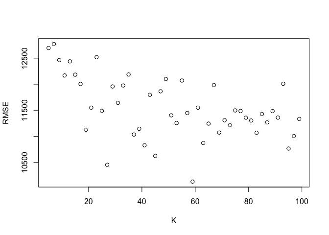
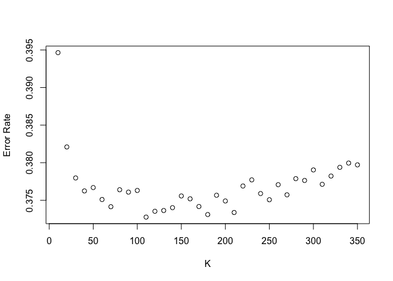

```{r setup, include=FALSE}
knitr::opts_chunk$set(echo = TRUE)
```
```{r, warning=FALSE, results='hold', message=FALSE, echo=FALSE}
# Load Libraries
library(tidyverse)
library(mosaic)
library(FNN)
library(foreach)
library(MASS)
library(caret)
# Load Data
sclass = read_csv('sclass.csv')
data(SaratogaHouses)
online_news = read_csv('online_news.csv')
```

Note: When measuring out-of-sample performance, there is random variation due to the particular choice of data points that end up
in the train/test split. For each model used, we addressed this by averaging the estimate of out-of-sample RMSE & accuracy over many
different random train/test splits.


## KNN Practice

Our goal was to use K-nearest neighbors to build a predictive model for price, given mileage, separately for each of two trim levels of S Class Mercedes Vehicles: 350 and 65 AMG. 
```{r, echo=FALSE }
# Focus on 2 trim levels: 350 and 65 AMG
sclass350 = subset(sclass, trim == '350')
sclass65AMG = subset(sclass, trim == '65 AMG')
# User-defined function to calculate the RMSE later on
rmse = function(y, yhat) {
  sqrt( mean( (y - yhat)^2 ) )
}
```
Let's take a look at the relationship between mileage and price for these two trims:
```{r, echo=FALSE}
plot(price ~ mileage, main = "S Class 350", data = sclass350)
plot(price ~ mileage, main = "S Class 65 AMG", data = sclass65AMG)
```

#### Analyzing the S Class 350

1) Split the data into a training and a testing set.

2) Run K-nearest-neighbors, for many different values of K, starting at K=2. 

3) For each value of K, fit the model to the training set and make predictions on the test set.

4) Calculate the out-of-sample root mean-squared error (RMSE) for each value of K.
```{r, echo=FALSE}
#sclass 350
k_grid350 = exp(seq(log(1), log(100), length=100)) %>% round %>% unique
err_grid350 = foreach(k = k_grid350, .combine='c') %do% {
  out = do(250)*{
    n = nrow(sclass350)
    n_train = round(0.8*n)  # round to nearest integer
    n_test = n - n_train
    train_cases = sample.int(n, n_train, replace=FALSE)
    test_cases = setdiff(1:n, train_cases)
    sclass350_train = sclass350[train_cases,]
    sclass350_test = sclass350[test_cases,]
    
    X_train = model.matrix(~ mileage - 1, data=sclass350_train)
    X_test = model.matrix(~ mileage - 1, data=sclass350_test)
    Y_train = sclass350_train$price
    Y_test = sclass350_test$price
    
    scale_factors = apply(X_train, 2, sd)
    X_train_sc = scale(X_train, scale=scale_factors)
    X_test_sc = scale(X_test, scale=scale_factors)
    
    knn_model = knn.reg(train=X_train_sc, test=X_test_sc, Y_train, k=k)
    rmse(Y_test, knn_model$pred)
  }
  mean(out$result)
}
```

The plot of RMSE for each value of K is shown as follows:
```{r, echo=FALSE}
plot(k_grid350, err_grid350, xlab="K", ylab="RMSE")
```

Based on this information, we can observe that the optimal value for K is around 30. With that said, we can now use this optimal K value to make predictions on our test set. The blue points represent the predicted prices for the optimized kNN model on the test set (black points).
```{r, echo=FALSE}
optimal_k350 = k_grid350[match(min(err_grid350), err_grid350)]
knn_model_optimal350 = knn.reg(train=X_train_sc, test=X_test_sc, Y_train, k=optimal_k350)
```
```{r, echo=FALSE}
plot(X_test, knn_model_optimal350$pred, col='blue', xlab='Mileage', ylab='Price')
points(X_test, Y_test, col='black')
```


#### Analyzing the S Class 65 AMG

Now we follow the same procedure for the S Class 65 AMG trim.

1) Split the data into a training and a testing set.

2) Run K-nearest-neighbors, for many different values of K, starting at K=2. 

3) For each value of K, fit the model to the training set and make predictions on the test set.

4) Calculate the out-of-sample root mean-squared error (RMSE) for each value of K.
```{r, echo=FALSE}
#sclass 65AMG
k_grid65AMG = exp(seq(log(1), log(100), length=100)) %>% round %>% unique
err_grid65AMG = foreach(k = k_grid65AMG, .combine='c') %do% {
  out = do(250)*{
    n = nrow(sclass65AMG)
    n_train = round(0.8*n)  # round to nearest integer
    n_test = n - n_train
    train_cases = sample.int(n, n_train, replace=FALSE)
    test_cases = setdiff(1:n, train_cases)
    sclass65AMG_train = sclass65AMG[train_cases,]
    sclass65AMG_test = sclass65AMG[test_cases,]
    
    X_train = model.matrix(~ mileage - 1, data=sclass65AMG_train)
    X_test = model.matrix(~ mileage - 1, data=sclass65AMG_test)
    Y_train = sclass65AMG_train$price
    Y_test = sclass65AMG_test$price
    
    scale_factors = apply(X_train, 2, sd)
    X_train_sc = scale(X_train, scale=scale_factors)
    X_test_sc = scale(X_test, scale=scale_factors)
    
    knn_model = knn.reg(train=X_train_sc, test=X_test_sc, Y_train, k=k)
    rmse(Y_test, knn_model$pred)
  }
  mean(out$result)
}
```

The plot of RMSE for each value of K is shown as follows:
```{r, echo=FALSE}
plot(k_grid65AMG, err_grid65AMG, xlab="K", ylab="RMSE")
```

```{r, echo=FALSE}
optimal_k65AMG = k_grid65AMG[match(min(err_grid65AMG), err_grid65AMG)]
knn_model_optimal65AMG = knn.reg(train=X_train_sc, test=X_test_sc, Y_train, k=optimal_k65AMG)
```

Based on this information, we can observe that the optimal value for K is around 40, higher than that of the S Class 350. However, what is critical to note in the comparison between S Class 350 and S Class 65 AMG is that the plot for S Class 350 converges to a minimum faster than the plot for S Class 65 AMG does. With that said, we can now use this optimal K value to make predictions on our test set. The blue points represent the predicted prices for the optimized kNN model on the test set (black points).
```{r, echo=FALSE}
plot(X_test, knn_model_optimal65AMG$pred, col='blue', xlim=c(0, 150000), ylim=c(0, 250000), xlab='Mileage', ylab='Price')
points(X_test, Y_test, col='black')
```

The main question to ask when comparing these two trim levels is: **Which trim yields a larger optimal value of K? Why do you think this is?**
The S Class 65 AMG tends to yield a larger optimal K value than the S Class 350. Some of the possible reasons are as follows:

1) For starters, the S Class 350 has a little more than 100 observations (416) more than the S Class 65 AMG (292).
2) *Price* - The 65 AMG is a much nicer car, as it is considered more of a sports car (sometimes even used in racing) while the 350 is a luxury sedan. Typically, a Mercedes that is labeled as 'AMG' comes with a higher price tag because these models have improved performance and specs.
3) *Variation* - The optimal K value is dependent on the variation of the data. With each new train/test split, the model will find various optimal K values. 
4) *Structure* - Since the datasets contain different observations, some of the available data might contain patterns which influence the K value (e.g. Clusters). As you might have noticed, the data for the S Class 350 is missing observations in a certain price range, causing a gap in the data.

## Saratoga House Prices

Goal 1: See if we can **"hand-build"** a model for price that outperforms the "medium" model currently being used to predict market values of properties for taxing purposes (the models created in class).

These are the linear models currently being used (including the medium):

```{r}
lm_small = lm(price ~ bedrooms + bathrooms + lotSize, data=SaratogaHouses)
lm_medium = lm(price ~ lotSize + age + livingArea + pctCollege + bedrooms + 
                 fireplaces + bathrooms + rooms + heating + fuel + centralAir, data=SaratogaHouses)
lm_big = lm(price ~ (. - sewer - waterfront - landValue - newConstruction)^2, data=SaratogaHouses)
```

```{r, echo=FALSE, message=FALSE, echo=FALSE, results='hide'}
# Recreating the small, medium, big model before
lm1 = lm(price ~ lotSize + bedrooms + bathrooms, data=SaratogaHouses)
lm2 = lm(price ~ . - sewer - waterfront - landValue - newConstruction, data=SaratogaHouses)
lm3 = lm(price ~ (. - sewer - waterfront - landValue - newConstruction)^2, data=SaratogaHouses)
# Coefficients
round(coef(lm1), 2)
round(coef(lm2), 2)
round(coef(lm3), 2)
```

The model we have hand-built for the taxing authority is:
```{r}
lm_outperform = lm(price ~ livingArea + bathrooms + rooms + waterfront + newConstruction + pctCollege + 
                   centralAir + livingArea*bedrooms + livingArea*bathrooms
                 + livingArea*rooms + bedrooms*rooms + fireplaces*fuel + lotSize*sewer, data=SaratogaHouses)
```

After much trial and error, we believe this is the best hand-built model in terms of accurately predicting home market values for the purpose of properly taxing them. We first started by focusing on including meaningful variables without overcomplicating the model, which could potentially overfit the data and fail to accurately analyze new information. We began by including the intuitive variables related to price such as the number of rooms and bathrooms, and also using interactions when features would have some relationship between one another. Next, we created a confusion matrix between the features with numerical data to identify possible correlations or relationships so we could incorporate the feature interaction in the model. We believe an important indicator your current models failed to include is the variable called pctCollege (percent of neighborhood that graduated college). This is because on average college degrees lead to higher salaries, which in turn lead to the higher purchasing power available and utilized by these individuals. Another important predictor we would like to point out is the interaction between fireplaces and fuel. While your medium model performs relatively well, we believe our model will be effective in helping you increase the efficiency in your performance by more accurately predicting the values of these homes. We would like to demonstrate our confidence in these claims by testing our model. 
```{r, echo=FALSE}
# Preparing for the tests
n = nrow(SaratogaHouses)
n_train = round(0.8*n)  # round to nearest integer
n_test = n - n_train
```

We will now train all four of the previous models on 100 train/test splits and average the RMSE to compare their out-of-sample performances.
```{r, echo=FALSE, message=FALSE, results='hide', warning=FALSE}
rmse_vals = do(100)*{
  
  # re-split into train and test cases with the same sample sizes
  train_cases = sample.int(n, n_train, replace=FALSE)
  test_cases = setdiff(1:n, train_cases)
  saratoga_train = SaratogaHouses[train_cases,]
  saratoga_test = SaratogaHouses[test_cases,]
  
  # Fit to the training data
  lm1 = lm(price ~ lotSize + bedrooms + bathrooms, data=saratoga_train)
  lm2 = lm(price ~ . - sewer - waterfront - landValue - newConstruction, data=saratoga_train)
  lm3 = lm(price ~ (. - sewer - waterfront - landValue - newConstruction)^2, data=saratoga_train)
  lm_outperform = lm(price ~ livingArea + bathrooms + rooms + waterfront + newConstruction + pctCollege + 
                   centralAir + livingArea*bedrooms + livingArea*bathrooms
                 + livingArea*rooms + bedrooms*rooms + fireplaces*fuel + lotSize*sewer, data=SaratogaHouses)
  
  # Predictions out of sample
  yhat_test1 = predict(lm1, saratoga_test)
  yhat_test2 = predict(lm2, saratoga_test)
  yhat_test3 = predict(lm3, saratoga_test)
  yhat_test_outperform = predict(lm_outperform, saratoga_test)
  
  c(rmse(saratoga_test$price, yhat_test1),
    rmse(saratoga_test$price, yhat_test2),
    rmse(saratoga_test$price, yhat_test3),
    rmse(saratoga_test$price, yhat_test_outperform))
}
```

Here are each of the averaged RMSE values for each model along with a visual representation:
```{r, echo=FALSE}
#rmse_vals
colMeans(rmse_vals)
boxplot(rmse_vals)
```

According to the RMSE values, our model reduces the error by almost $4000 on average. This reduction in error could potentially help improve the way you do your job. Keep in mind, we left out the landValue variable, which is highly related to price, since they are similar in nature. As a local taxing authority, you are probably more interested in using the land value as an indicator. Given more context, we could potentially run these models to predict land values, and use these results in conjunction with the previous models for more accurate insights. We will now outline these results for you.

```{r, echo=FALSE, message=FALSE, results='hide', warning=FALSE}
rmse_vals = do(100)*{
  
  # re-split into train and test cases with the same sample sizes
  train_cases = sample.int(n, n_train, replace=FALSE)
  test_cases = setdiff(1:n, train_cases)
  saratoga_train = SaratogaHouses[train_cases,]
  saratoga_test = SaratogaHouses[test_cases,]
  
  # Fit to the training data
  lm1 = lm(landValue ~ lotSize + bedrooms + bathrooms + price, data=saratoga_train)
  lm2 = lm(landValue ~ . - sewer - waterfront - landValue - newConstruction, data=saratoga_train)
  lm3 = lm(landValue ~ (. - sewer - waterfront - landValue - newConstruction)^2, data=saratoga_train)
  lm_outperform = lm(landValue ~ price + livingArea + bathrooms + rooms + waterfront + newConstruction + pctCollege + 
                   centralAir + livingArea*bedrooms + livingArea*bathrooms
                 + livingArea*rooms + bedrooms*rooms + fireplaces*fuel + lotSize*sewer, data=SaratogaHouses)
  
  # Predictions out of sample
  yhat_test1 = predict(lm1, saratoga_test)
  yhat_test2 = predict(lm2, saratoga_test)
  yhat_test3 = predict(lm3, saratoga_test)
  yhat_test_outperform = predict(lm_outperform, saratoga_test)
  
  c(rmse(saratoga_test$price, yhat_test1),
    rmse(saratoga_test$price, yhat_test2),
    rmse(saratoga_test$price, yhat_test3),
    rmse(saratoga_test$price, yhat_test_outperform))
}
```

Here is averaged RMSE value over 100 train/test splits for this approach along with a visual representation:
```{r, echo=FALSE}
#rmse_vals
colMeans(rmse_vals)
boxplot(rmse_vals)
```

We hope this has provided meaningful insight, and will lead to an improvement from the current system.

Goal 2: See if we can turn this hand-built linear model into a better-performing KNN model.

Therefore, we will take the same approach on the same exact hand-built model to determine whether or not its form as a kNN regression will outperform the linear version.
```{r, echo=FALSE}
k_grid = exp(seq(log(1), log(100), length=100)) %>% round %>% unique
err_grid = foreach(k = k_grid, .combine='c') %do% {
  out = do(100)*{
    n = nrow(SaratogaHouses)
    n_train = round(0.8*n)  # round to nearest integer
    n_test = n - n_train
    train_cases = sample.int(n, n_train, replace=FALSE)
    test_cases = setdiff(1:n, train_cases)
    train = SaratogaHouses[train_cases,]
    test = SaratogaHouses[test_cases,]
    
    X_train = model.matrix(price ~ livingArea + bathrooms + rooms + waterfront + newConstruction + pctCollege + 
                             centralAir - 1, data=train)
    X_test = model.matrix(price ~ livingArea + bathrooms + rooms + waterfront + newConstruction + pctCollege + 
                            centralAir - 1, data=test)
    Y_train = train$price
    Y_test = test$price
    
    scale_factors = apply(X_train, 2, sd)
    X_train_sc = scale(X_train, scale=scale_factors)
    X_test_sc = scale(X_test, scale=scale_factors)
    
    knn_model = knn.reg(train=X_train_sc, test=X_test_sc, Y_train, k=k)
    rmse(Y_test, knn_model$pred)
  }
  mean(out$result)
}
```

The chart below displays the average RMSE produced by each value of K. We observe that the optimal K value is located around 20. We can then use this value to build a kNN model for predictions.
```{r, echo=FALSE}
plot(k_grid, err_grid, xlab="K", ylab="RMSE")
```

Here we predict on the test set using this model and compare it to the hand-built linear model.
```{r, echo=FALSE}
optimal_k = k_grid[match(min(err_grid), err_grid)]
knn_model_optimal = knn.reg(train=X_train_sc, test=X_test_sc, Y_train, k=optimal_k)
min(err_grid)
```

As you can see, the RMSE is worse than that of the linear model. Although this kNN regression could potentially be improved by engaging in feature selection, the kNN equivalent of the linear model performs worse on average (increased RMSE). Therefore we would recommend utilizing the linear regression in the meantime, until a better performing kNN model is discovered.


## Predicting When Articles Go Viral

The data in online_news.csv contains data on 39,797 online articles published by Mashable during 2013 and 2014. The target
variable is shares, i.e. how many times the article was shared on social media. Mashable is interested in building a model for
whether the article goes viral or not. They judge this on the basis of a cutoff of 1400 shares -- that is, the article is judged
to be "viral" if shares > 1400. 

Throughout this problem, we will represent the viral status of a post through digits, with 1 representing "Viral", and 0 representing "Not Viral".

To evaluate these models, we will use the following metrics:
* Confusion Matrix: a specific table layout that allows visualization of the performance of an algorithm (such as the true positive rate and false positive rate)
* Overall Accuracy/Error Rate: the number of all incorrect predictions divided by the total number of observations in the dataset.
* True Positive Rate (aka Recall or Sensitivity): measures the proportion of actual positives that are correctly identified as such 
* False Positive Rate: the probability that a false alarm will be raised: that a positive result will be given when the true value is negative.

For this exercise, the 'positive' class in questions is that of 'not viral', since this is the majority class that the baseline model will use to make predictions.

#### Base Model for Comparison

As a base model, we observe the dataset and notice the following results:
```{r, echo=FALSE}
total_posts = nrow(online_news)

viral = online_news %>% 
  filter(shares > 1400)
viral_posts = nrow(viral)

not_viral = online_news %>% 
  filter(shares <= 1400)
not_viral_posts = nrow(not_viral)

percent_viral = viral_posts / total_posts

percent_not_viral = not_viral_posts / total_posts

# Model would predict viral for every post with about a 53% success rate
```
Out of every observation for the shares (target) column, the proportion of viral posts (>1400 shares) is
```{r, echo=FALSE}
percent_viral
```
While the proportion of non-viral posts (< or = 1400 shares) is
```{r, echo=FALSE}
percent_not_viral
```

Based on these observations, a baseline model would predict not viral for every post (since the not viral class is the majority) with about 50.65% accuracy on average. We can observe this by implementing this reasoning on several test sets.
```{r, echo=FALSE}
new_shares = COPY<-data.frame(online_news)
new_shares$shares = ifelse(new_shares$shares > 1400, "Viral", "Not_Viral")
i = 0
accuracies <- c()
# Do 20 times
while (i < 100) {
  # Grab a sample of about 10% 
  sample = new_shares[sample(nrow(new_shares), 3965), ]
  # Guess Not Viral
  not_viral = sample %>%
    filter(shares == "Not_Viral")
  not_viral_posts = nrow(not_viral)
  # Calculate Proportion Correct
  percent_not_viral = not_viral_posts / nrow(sample)
  accuracies <- c(accuracies, percent_not_viral)
  i = i + 1
}
```
After pulling random samples of ~10% of the total observations from the target column and predicting 'Not Viral' for each instance, we get an average (from 100 tests) accuracy of
```{r, echo=FALSE}
mean(accuracies)
```

The more tests performed, the closer the average accuracy will get to the observed 50.65% accuracy.

#### Regression Approach

Given the large dataset with many variables, and for the sake of comparing models rather than selecting the right features, we used AIC to narrow down to engage in some feature selection for this problem.
```{r, echo=FALSE}
online_news <- online_news[-1] # get rid of url
```
```{r, echo=FALSE}
new_shares = COPY<-data.frame(online_news)
lm = lm(shares ~ ., data=new_shares)
```
```{r, message=FALSE, results='hide', warning=FALSE, echo=FALSE}
# Get call?
stepAIC(lm, direction = 'both')
```

##### Linear Regression

Based on these results, we built the following regression:
```{r}
lm = lm(shares ~ n_tokens_title + n_tokens_content + num_hrefs + num_imgs + num_videos + average_token_length + num_keywords + 
            + weekday_is_tuesday + weekday_is_wednesday + weekday_is_thursday + weekday_is_friday + avg_positive_polarity +
            avg_negative_polarity + abs_title_sentiment_polarity, data=new_shares)
```

```{r, echo=FALSE}
n = nrow(new_shares)
n_train = round(0.8*n)  # round to nearest integer
n_test = n - n_train
```

```{r, echo=FALSE}
rmse_vals = do(100)*{
  
  # re-split into train and test cases with the same sample sizes
  train_cases = sample.int(n, n_train, replace=FALSE)
  test_cases = setdiff(1:n, train_cases)
  viral_train = online_news[train_cases,]
  viral_test = online_news[test_cases,]
  
  # Fit to the training data
  lm = lm(shares ~ n_tokens_title + n_tokens_content + num_hrefs + num_imgs + num_videos + average_token_length + num_keywords + 
            + weekday_is_tuesday + weekday_is_wednesday + weekday_is_thursday + weekday_is_friday + avg_positive_polarity +
            avg_negative_polarity + abs_title_sentiment_polarity, data=viral_train)
  
  # Predictions out of sample
  yhat_test = predict(lm, viral_test)
  
  
  c(rmse(viral_test$shares, yhat_test))
}
```

After running it on multiple train/test splits, we received these results.

RMSE:
```{r, echo=FALSE}
#rmse_vals
colMeans(rmse_vals)
```

Confusion Matrix:
```{r, echo=FALSE}
yhat_test = predict(lm, viral_test)
yhat_test = as.integer(yhat_test)
viral_test$shares = ifelse(viral_test$shares > 1400, 1, 0)
yhat_test = ifelse(yhat_test > 1400, 1, 0)
conf = table(viral_test$shares, yhat_test)
#conf
confusionMatrix(table(yhat_test, viral_test$shares))
```

Overall Error Rate: ~ 0.5031
```{r, echo=FALSE, results='hold'}
# 1 - (sum(diag(conf))/n_test)
```

True Positive Rate: ~ 0.002

False Positive Rate: ~ 0.003

Compared to the baseline model, the linear regression appears to perform slightly worse.

##### Logit & Probit Regression

Now we will perform both a logit and probit model, however, using all possible features.

```{r, echo=FALSE}
# Data Preprocessing
new_shares = COPY<-data.frame(online_news)
new_shares$shares = ifelse(new_shares$shares > 1400,as.integer(1),as.integer(0))
attach(new_shares)
Y <- cbind(shares)
X <- cbind(n_tokens_title,n_tokens_content,num_hrefs,num_self_hrefs,num_imgs,num_videos,
           average_token_length,num_keywords,data_channel_is_lifestyle,data_channel_is_entertainment,
           data_channel_is_bus,data_channel_is_socmed,data_channel_is_tech,data_channel_is_world,
           self_reference_min_shares,self_reference_max_shares,self_reference_avg_sharess,weekday_is_monday,
           weekday_is_tuesday,weekday_is_wednesday,weekday_is_thursday,weekday_is_friday,weekday_is_saturday,
           weekday_is_sunday,is_weekend,global_rate_positive_words,global_rate_negative_words,avg_positive_polarity,
           min_positive_polarity,max_positive_polarity,avg_negative_polarity,min_negative_polarity,max_negative_polarity,
           title_subjectivity,title_sentiment_polarity,abs_title_sentiment_polarity)
```

```{r, message=FALSE, results='hide', warning=FALSE}
# The Models
# Logit Model
logit <- glm(Y ~ X, family=binomial (link = "logit"))
# Probit Model
probit <- glm(Y ~ X, family=binomial (link = "probit"))
```

```{r, echo=FALSE, results='hide'}
# Avg Marginal Effects
# Logit
LogitScalar <- mean(dlogis(predict(logit, type = "link")))
LogitScalar * coef(logit)
# Probit
ProbitScalar <- mean(dnorm(predict(probit, type = "link")))
ProbitScalar * coef(probit)
```

Now we can predict on the test set using both of these models and compare their performance. These models produced the following confusion matrices, respectively.
```{r, echo=FALSE}
# Predictions
# Logit
plogit <- predict(logit, type="response")
# Probit
pprobit <- predict(probit, type="response")

# % Correct
table(true = Y, pred = round(fitted(probit)))
table(true = Y, pred = round(fitted(logit)))
```

Overall Error Rate:
Logit ~ 0.37
Probit ~ 0.37

True Positive Rate:
Logit ~ 0.63
Probit ~ 0.63

False Positive Rate:
Logit ~ 0.36
Probit ~ 0.36

Both the logit and probit models show significant improvement over the baseline model.

##### KNN Regression

As we did in the previous problems, we will now transform the linear regression into a kNN regression (use the same features).
```{r, echo=FALSE, warning=FALSE, message=FALSE}
new_shares = COPY<-data.frame(online_news)
n = nrow(new_shares)
n_train = round(0.8*n)  # round to nearest integer
n_test = n - n_train
k_grid = seq(5, 100, by=2) 
```

```{r, echo=FALSE, eval=FALSE}
err_grid = foreach(k = k_grid, .combine='c') %do% {
  out = do(20)*{ # 100
      train_cases = sample.int(n, n_train, replace=FALSE)
      test_cases = setdiff(1:n, train_cases)
      train = new_shares[train_cases,]
      test = new_shares[test_cases,]
      
      X_train = model.matrix(shares ~ n_tokens_title + n_tokens_content + num_hrefs + num_imgs + num_videos + average_token_length + num_keywords + 
                               + weekday_is_tuesday + weekday_is_wednesday + weekday_is_thursday + weekday_is_friday + avg_positive_polarity +
                               avg_negative_polarity + abs_title_sentiment_polarity - 1, data=train)
      X_test = model.matrix(shares ~ n_tokens_title + n_tokens_content + num_hrefs + num_imgs + num_videos + average_token_length + num_keywords + 
                              + weekday_is_tuesday + weekday_is_wednesday + weekday_is_thursday + weekday_is_friday + avg_positive_polarity +
                              avg_negative_polarity + abs_title_sentiment_polarity - 1, data=test)
      Y_train = train$shares
      Y_test = test$shares
      
      scale_factors = apply(X_train, 2, sd)
      X_train_sc = scale(X_train, scale=scale_factors)
      X_test_sc = scale(X_test, scale=scale_factors)
      
      knn_model = knn.reg(train=X_train_sc, test=X_test_sc, Y_train, k=k)
      rmse(Y_test, knn_model$pred)
  }
  mean(out$result)
}
```

The plot of RMSE for each value of K is shown as follows:
```{r, echo=FALSE, eval=FALSE}
plot(k_grid, err_grid, xlab="K", ylab="RMSE")
```


Based on this information, we can observe that the optimal value for K is around 60. With that said, we can now use this optimal K value to make predictions on our test set.

```{r, echo=FALSE}
train_cases = sample.int(n, n_train, replace=FALSE)
test_cases = setdiff(1:n, train_cases)
train = new_shares[train_cases,]
test = new_shares[test_cases,]
      
X_train = model.matrix(shares ~ n_tokens_title + n_tokens_content + num_hrefs + num_imgs + num_videos + average_token_length + num_keywords + 
                               + weekday_is_tuesday + weekday_is_wednesday + weekday_is_thursday + weekday_is_friday + avg_positive_polarity +
                               avg_negative_polarity + abs_title_sentiment_polarity - 1, data=train)
X_test = model.matrix(shares ~ n_tokens_title + n_tokens_content + num_hrefs + num_imgs + num_videos + average_token_length + num_keywords + 
                              + weekday_is_tuesday + weekday_is_wednesday + weekday_is_thursday + weekday_is_friday + avg_positive_polarity +
                              avg_negative_polarity + abs_title_sentiment_polarity - 1, data=test)
Y_train = train$shares
Y_test = test$shares
      
scale_factors = apply(X_train, 2, sd)
X_train_sc = scale(X_train, scale=scale_factors)
X_test_sc = scale(X_test, scale=scale_factors)

optimal_k = k_grid[match(min(err_grid), err_grid)]
knn_model_optimal = knn.reg(train=X_train_sc, test=X_test_sc, Y_train, k=60)
```

The results are as follows:

Confusion Matrix:
```{r, echo=FALSE}
viral_y_test = ifelse(Y_test > 1400, 1, 0)
knn_model_optimal = as.numeric(unlist(knn_model_optimal$pred))
viral_test_knn = ifelse(knn_model_optimal > 1400, 1, 0)
conf_knn = table(viral_y_test, viral_test_knn)
conf_knn
```

Overall Error Rate:
```{r, echo=FALSE}
1 - (sum(diag(conf_knn))/n_test)
```

True Positive Rate: ~ 0.013

False Positive Rate: ~ 0.006

This approach performs about the same as the baseline model in terms of accuracy.


#### Classification Approach

##### kNN Classification Model

Now we will approach this problem from a classification standpoint. That is, use a kNN classification model with the hopes of predicting whether a post will achieve a viral status or not.

```{r, echo=FALSE, warning=FALSE, message=FALSE}
# Data Preprocessing
online_news = read_csv('online_news.csv')
new_shares = COPY<-data.frame(online_news)
#online_news$shares = ifelse(online_news$shares > 1400,"Viral","Not_Viral")
new_shares$viral = ifelse(new_shares$shares > 1400,1,0)
new_shares$viral[new_shares$viral == 0] <- "No" # Not Viral
new_shares$viral[new_shares$viral == 1] <- "Yes" # Viral
new_shares$viral <- factor(new_shares$viral)
new_shares <- new_shares[-1] # get rid of url
new_shares <- new_shares[-37] # get rid of shares
X = dplyr::select(new_shares, -viral)
y = new_shares$viral # or shares
n = length(y)
# select a training set
n_train = round(0.8*n)
n_test = n - n_train
```

```{r, echo=FALSE, warning=FALSE, message=FALSE, eval=FALSE}
# Running the Model
k_grid = seq(10, 350, by=10) # 10, 300, 20
err_grid = foreach(k = k_grid,  .combine='c') %do% {
  out = do(20)*{
    train_ind = sample.int(n, n_train)
    X_train = X[train_ind,]
    X_test = X[-train_ind,]
    Y_train = y[train_ind]
    Y_test = y[-train_ind]
    
    # scale the training set features
    scale_factors = apply(X_train, 2, sd)
    X_train_sc = scale(X_train, scale=scale_factors)
    
    # scale the test set features using the same scale factors
    X_test_sc = scale(X_test, scale=scale_factors)
    
    # Fit KNN models (notice the odd values of K)
    knn_try = class::knn(train=X_train_sc, test= X_test_sc, cl=Y_train, k=k)
    
    # Calculating classification errors
    sum(knn_try != Y_test)/n_test
  } 
  mean(out$result)
}
```

The optimal K value can be visually assessed here:
```{r, echo=FALSE, eval=FALSE}
plot(k_grid, err_grid, xlab="K", ylab="Error Rate")
```


The optimal K value appears to be around 110. Now we can build a model using this K value, and evaluate its predictive performance.
```{r, echo=FALSE}
train_ind = sample.int(n, n_train)
X_train = X[train_ind,]
X_test = X[-train_ind,]
Y_train = y[train_ind]
Y_test = y[-train_ind]
    
# scale the training set features
scale_factors = apply(X_train, 2, sd)
X_train_sc = scale(X_train, scale=scale_factors)
    
# scale the test set features using the same scale factors
X_test_sc = scale(X_test, scale=scale_factors)

optimal_k = k_grid[match(min(err_grid), err_grid)]
knn_model_optimal = class::knn(train=X_train_sc, test=X_test_sc, Y_train, k=110)
```

Performance Summary:
```{r, echo=FALSE}
confusionMatrix(table(knn_model_optimal, Y_test))
```

Overall Error Rate: ~ 0.3766

True Positive Rate: ~ 0.6793

False Positive Rate: ~ 0.4327

This approach shows significant improvement over both the baseline model, and the models produced from a regression approach.

**Conclusion** 
All in all, this problem presented two strategies of finding a solution. The first (regression approach) stated to regress first and threshold second. The second (classification approach) said to threshold first and regress/classify second, which ultimately provided stronger accuracy and results. For this specific problem, we are categorizing output into labels of viral or not viral. Regression predicts outputs through continuous values, and therefore was overly optimistic about the virality of a post (ultimately predicting large numbers of shars that led to predicting "viral" for many isntances, which is the oposite from our positive class of "not viral". Because the dataset was so extensive, with many different features filled with noise and interactions regarding number of shares (or virality), the predicted output values would have a high variance. Consequently, when we regress first and threshold second, we cannot predict virality very confidently. Thus, classificaiton provided a much stronger alternative for producing more accurate predictions for online news virality.

Questions: 
**Which approach performs better: regress first and threshold second, or threshold first and regress/classify second? Why do you think this is?**

**Mashable wants to know if there's anything they can learn about how to improve an article's chance of reaching this threshold.** (E.g. by telling people to write shorter headlines, snarkier articles, or whatever.)

To get an idea of some characteristics that might answer this, we can refer to the coefficients of the logistic regression (logit) model. 
```{r, echo=FALSE}
summary(logit)
```

These coefficients are interpreted as an odds multiplier or odds ratio for a one-unit increase in the variable. Therefore, if you take one of the variables such as 'Xnum_imgs' (the number of images an article has) as an example, the odds of an article going viral are multiplied by e to the power of that coefficient. This means, for negative factors, the multiplier will turn in to a proportion, thus decreasing the odds. 

We can also observe the marginal effects:
```{r, echo=FALSE}
# Avg Marginal Effects
# Logit
LogitScalar <- mean(dlogis(predict(logit, type = "link")))
LogitScalar * coef(logit)
```

Disclaimer: there was little to no emphasis or focus on feature selection for this assignment, and therefore these models have the potential to be improved through such a process.


