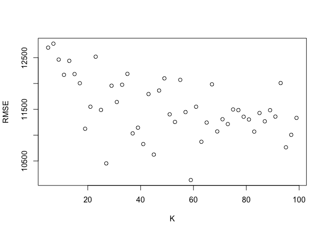

SDS 323: Exercises 2
================

Note: When measuring out-of-sample performance, there is random
variation due to the particular choice of data points that end up in the
train/test split. For each model used, we addressed this by averaging
the estimate of out-of-sample RMSE & accuracy over many different random
train/test splits.

## KNN Practice

Our goal was to use K-nearest neighbors to build a predictive model for
price, given mileage, separately for each of two trim levels of S Class
Mercedes Vehicles: 350 and 65 AMG.

Let’s take a look at the relationship between mileage and price for
these two trims:
<!-- --><!-- -->

#### Analyzing the S Class 350

1)  Split the data into a training and a testing set.

2)  Run K-nearest-neighbors, for many different values of K, starting at
    K=2.

3)  For each value of K, fit the model to the training set and make
    predictions on the test set.

4)  Calculate the out-of-sample root mean-squared error (RMSE) for each
    value of K.

The plot of RMSE for each value of K is shown as follows:
<!-- -->

Based on this information, we can observe that the optimal value for K
is around 30. With that said, we can now use this optimal K value to
make predictions on our test set. The blue points represent the
predicted prices for the optimized kNN model on the test set (black
points).

<!-- -->

#### Analyzing the S Class 65 AMG

Now we follow the same procedure for the S Class 65 AMG trim.

1)  Split the data into a training and a testing set.

2)  Run K-nearest-neighbors, for many different values of K, starting at
    K=2.

3)  For each value of K, fit the model to the training set and make
    predictions on the test set.

4)  Calculate the out-of-sample root mean-squared error (RMSE) for each
    value of K.

The plot of RMSE for each value of K is shown as follows:
<!-- -->

Based on this information, we can observe that the optimal value for K
is around 40, higher than that of the S Class 350. However, what is
critical to note in the comparison between S Class 350 and S Class 65
AMG is that the plot for S Class 350 converges to a minimum faster than
the plot for S Class 65 AMG does. With that said, we can now use this
optimal K value to make predictions on our test set. The blue points
represent the predicted prices for the optimized kNN model on the test
set (black points).
<!-- -->

The main question to ask when comparing these two trim levels is:
**Which trim yields a larger optimal value of K? Why do you think this
is?** The S Class 65 AMG tends to yield a larger optimal K value than
the S Class 350. Some of the possible reasons are as follows:

1)  For starters, the S Class 350 has a little more than 100
    observations (416) more than the S Class 65 AMG (292).
2)  *Price* - The 65 AMG is a much nicer car, as it is considered more
    of a sports car (sometimes even used in racing) while the 350 is a
    luxury sedan. Typically, a Mercedes that is labeled as ‘AMG’ comes
    with a higher price tag because these models have improved
    performance and specs.
3)  *Variation* - The optimal K value is dependent on the variation of
    the data. With each new train/test split, the model will find
    various optimal K values.
4)  *Structure* - Since the datasets contain different observations,
    some of the available data might contain patterns which influence
    the K value (e.g. Clusters). As you might have noticed, the data for
    the S Class 350 is missing observations in a certain price range,
    causing a gap in the data.

## Saratoga House Prices

Goal 1: See if we can **“hand-build”** a model for price that
outperforms the “medium” model currently being used to predict market
values of properties for taxing purposes (the models created in class).

These are the linear models currently being used (including the
medium):

``` r
lm_small = lm(price ~ bedrooms + bathrooms + lotSize, data=SaratogaHouses)
lm_medium = lm(price ~ lotSize + age + livingArea + pctCollege + bedrooms + 
                 fireplaces + bathrooms + rooms + heating + fuel + centralAir, data=SaratogaHouses)
lm_big = lm(price ~ (. - sewer - waterfront - landValue - newConstruction)^2, data=SaratogaHouses)
```

The model we have hand-built for the taxing authority
is:

``` r
lm_outperform = lm(price ~ livingArea + bathrooms + rooms + waterfront + newConstruction + pctCollege + 
                   centralAir + livingArea*bedrooms + livingArea*bathrooms
                 + livingArea*rooms + bedrooms*rooms + fireplaces*fuel + lotSize*sewer, data=SaratogaHouses)
```

After much trial and error, we believe this is the best hand-built model
in terms of accurately predicting home market values for the purpose of
properly taxing them. We first started by focusing on including
meaningful variables without overcomplicating the model, which could
potentially overfit the data and fail to accurately analyze new
information. We began by including the intuitive variables related to
price such as the number of rooms and bathrooms, and also using
interactions when features would have some relationship between one
another. Next, we created a confusion matrix between the features with
numerical data to identify possible correlations or relationships so we
could incorporate the feature interaction in the model. We believe an
important indicator your current models failed to include is the
variable called pctCollege (percent of neighborhood that graduated
college). This is because on average college degrees lead to higher
salaries, which in turn lead to the higher purchasing power available
and utilized by these individuals. Another important predictor we would
like to point out is the interaction between fireplaces and fuel. While
your medium model performs relatively well, we believe our model will be
effective in helping you increase the efficiency in your performance by
more accurately predicting the values of these homes. We would like to
demonstrate our confidence in these claims by testing our model.

We will now train all four of the previous models on 100 train/test
splits and average the RMSE to compare their out-of-sample performances.

Here are each of the averaged RMSE values for each model along with a
visual representation:

    ##       V1       V2       V3       V4 
    ## 76324.16 65661.52 74033.20 62019.59

<!-- -->

According to the RMSE values, our model reduces the error by almost
$4000 on average. This reduction in error could potentially help improve
the way you do your job. Keep in mind, we left out the landValue
variable, which is highly related to price, since they are similar in
nature. As a local taxing authority, you are probably more interested in
using the land value as an indicator. Given more context, we could
potentially run these models to predict land values, and use these
results in conjunction with the previous models for more accurate
insights. We will now outline these results for you.

Here is averaged RMSE value over 100 train/test splits for this approach
along with a visual representation:

    ##       V1       V2       V3       V4 
    ## 193377.0 193595.7 193926.7 193611.2

<!-- -->

We hope this has provided meaningful insight, and will lead to an
improvement from the current system.

Goal 2: See if we can turn this hand-built linear model into a
better-performing KNN model.

Therefore, we will take the same approach on the same exact hand-built
model to determine whether or not its form as a kNN regression will
outperform the linear version.

The chart below displays the average RMSE produced by each value of K.
We observe that the optimal K value is located around 20. We can then
use this value to build a kNN model for predictions.
<!-- -->

Here we predict on the test set using this model and compare it to the
hand-built linear model.

    ## [1] 64822.48

As you can see, the RMSE is worse than that of the linear model.
Although this kNN regression could potentially be improved by engaging
in feature selection, the kNN equivalent of the linear model performs
worse on average (increased RMSE). Therefore we would recommend
utilizing the linear regression in the meantime, until a better
performing kNN model is discovered.

## Predicting When Articles Go Viral

The data in online\_news.csv contains data on 39,797 online articles
published by Mashable during 2013 and 2014. The target variable is
shares, i.e. how many times the article was shared on social media.
Mashable is interested in building a model for whether the article goes
viral or not. They judge this on the basis of a cutoff of 1400 shares –
that is, the article is judged to be “viral” if shares \> 1400.

Throughout this problem, we will represent the viral status of a post
through digits, with 1 representing “Viral”, and 0 representing “Not
Viral”.

To evaluate these models, we will use the following metrics: \*
Confusion Matrix: a specific table layout that allows visualization of
the performance of an algorithm (such as the true positive rate and
false positive rate) \* Overall Accuracy/Error Rate: the number of all
incorrect predictions divided by the total number of observations in the
dataset. \* True Positive Rate (aka Recall or Sensitivity): measures the
proportion of actual positives that are correctly identified as such \*
False Positive Rate: the probability that a false alarm will be raised:
that a positive result will be given when the true value is negative.

For this exercise, the ‘positive’ class in questions is that of ‘not
viral’, since this is the majority class that the baseline model will
use to make predictions.

#### Base Model for Comparison

As a base model, we observe the dataset and notice the following
results:

Out of every observation for the shares (target) column, the proportion
of viral posts (\>1400 shares) is

    ## [1] 0.4934416

While the proportion of non-viral posts (\< or = 1400 shares) is

    ## [1] 0.5065584

Based on these observations, a baseline model would predict not viral
for every post (since the not viral class is the majority) with about
50.65% accuracy on average. We can observe this by implementing this
reasoning on several test sets.

After pulling random samples of ~10% of the total observations from the
target column and predicting ‘Not Viral’ for each instance, we get an
average (from 100 tests) accuracy of

    ## [1] 0.5066103

The more tests performed, the closer the average accuracy will get to
the observed 50.65% accuracy.

#### Regression Approach

Given the large dataset with many variables, and for the sake of
comparing models rather than selecting the right features, we used AIC
to narrow down to engage in some feature selection for this problem.

##### Linear Regression

Based on these results, we built the following
regression:

``` r
lm = lm(shares ~ n_tokens_title + n_tokens_content + num_hrefs + num_imgs + num_videos + average_token_length + num_keywords + 
            + weekday_is_tuesday + weekday_is_wednesday + weekday_is_thursday + weekday_is_friday + avg_positive_polarity +
            avg_negative_polarity + abs_title_sentiment_polarity, data=new_shares)
```

After running it on multiple train/test splits, we received these
results.

RMSE:

    ##   result 
    ## 11031.49

Confusion Matrix:

    ## Confusion Matrix and Statistics
    ## 
    ##          
    ## yhat_test    0    1
    ##         0   12   10
    ##         1 4083 3824
    ##                                           
    ##                Accuracy : 0.4838          
    ##                  95% CI : (0.4727, 0.4949)
    ##     No Information Rate : 0.5165          
    ##     P-Value [Acc > NIR] : 1               
    ##                                           
    ##                   Kappa : 3e-04           
    ##                                           
    ##  Mcnemar's Test P-Value : <2e-16          
    ##                                           
    ##             Sensitivity : 0.002930        
    ##             Specificity : 0.997392        
    ##          Pos Pred Value : 0.545455        
    ##          Neg Pred Value : 0.483622        
    ##              Prevalence : 0.516459        
    ##          Detection Rate : 0.001513        
    ##    Detection Prevalence : 0.002775        
    ##       Balanced Accuracy : 0.500161        
    ##                                           
    ##        'Positive' Class : 0               
    ## 

Overall Error Rate: ~ 0.5031

True Positive Rate: ~ 0.002

False Positive Rate: ~ 0.003

Compared to the baseline model, the linear regression appears to perform
slightly worse.

##### Logit & Probit Regression

Now we will perform both a logit and probit model, however, using all
possible features.

``` r
# The Models
# Logit Model
logit <- glm(Y ~ X, family=binomial (link = "logit"))
# Probit Model
probit <- glm(Y ~ X, family=binomial (link = "probit"))
```

Now we can predict on the test set using both of these models and
compare their performance. These models produced the following confusion
matrices, respectively.

    ##     pred
    ## true     0     1
    ##    0 12582  7500
    ##    1  7225 12337

    ##     pred
    ## true     0     1
    ##    0 12637  7445
    ##    1  7249 12313

Overall Error Rate: Logit ~ 0.37 Probit ~ 0.37

True Positive Rate: Logit ~ 0.63 Probit ~ 0.63

False Positive Rate: Logit ~ 0.36 Probit ~ 0.36

Both the logit and probit models show significant improvement over the
baseline model.

##### KNN Regression

As we did in the previous problems, we will now transform the linear
regression into a kNN regression (use the same features).

The plot of RMSE for each value of K is shown as follows:



Based on this information, we can observe that the optimal value for K
is around 60. With that said, we can now use this optimal K value to
make predictions on our test set.

The results are as follows:

Confusion Matrix:

    ##             viral_test_knn
    ## viral_y_test    0    1
    ##            0   14 3971
    ##            1    7 3937

Overall Error Rate:

    ## [1] 0.5017026

True Positive Rate: ~ 0.013

False Positive Rate: ~ 0.006

This approach performs about the same as the baseline model in terms of
accuracy.

#### Classification Approach

##### kNN Classification Model

Now we will approach this problem from a classification standpoint. That
is, use a kNN classification model with the hopes of predicting whether
a post will achieve a viral status or not.

The optimal K value can be visually assessed here:


The optimal K value appears to be around 110. Now we can build a model
using this K value, and evaluate its predictive performance.

Performance Summary:

    ## Confusion Matrix and Statistics
    ## 
    ##                  Y_test
    ## knn_model_optimal   No  Yes
    ##               No  2714 1661
    ##               Yes 1297 2257
    ##                                           
    ##                Accuracy : 0.6269          
    ##                  95% CI : (0.6162, 0.6376)
    ##     No Information Rate : 0.5059          
    ##     P-Value [Acc > NIR] : < 2.2e-16       
    ##                                           
    ##                   Kappa : 0.253           
    ##                                           
    ##  Mcnemar's Test P-Value : 2.484e-11       
    ##                                           
    ##             Sensitivity : 0.6766          
    ##             Specificity : 0.5761          
    ##          Pos Pred Value : 0.6203          
    ##          Neg Pred Value : 0.6351          
    ##              Prevalence : 0.5059          
    ##          Detection Rate : 0.3423          
    ##    Detection Prevalence : 0.5518          
    ##       Balanced Accuracy : 0.6263          
    ##                                           
    ##        'Positive' Class : No              
    ## 

Overall Error Rate: ~ 0.3766

True Positive Rate: ~ 0.6793

False Positive Rate: ~ 0.4327

This approach shows significant improvement over both the baseline
model, and the models produced from a regression approach.

**Conclusion** All in all, this problem presented two strategies of
finding a solution. The first (regression approach) stated to regress
first and threshold second. The second (classification approach) said to
threshold first and regress/classify second, which ultimately provided
stronger accuracy and results. For this specific problem, we are
categorizing output into labels of viral or not viral. Regression
predicts outputs through continuous values, and therefore was overly
optimistic about the virality of a post (ultimately predicting large
numbers of shars that led to predicting “viral” for many isntances,
which is the oposite from our positive class of “not viral”. Because the
dataset was so extensive, with many different features filled with noise
and interactions regarding number of shares (or virality), the predicted
output values would have a high variance. Consequently, when we regress
first and threshold second, we cannot predict virality very confidently.
Thus, classificaiton provided a much stronger alternative for producing
more accurate predictions for online news virality.

Questions: **Which approach performs better: regress first and threshold
second, or threshold first and regress/classify second? Why do you think
this is?**

**Mashable wants to know if there’s anything they can learn about how to
improve an article’s chance of reaching this threshold.** (E.g. by
telling people to write shorter headlines, snarkier articles, or
whatever.)

To get an idea of some characteristics that might answer this, we can
refer to the coefficients of the logistic regression (logit) model.

    ## 
    ## Call:
    ## glm(formula = Y ~ X, family = binomial(link = "logit"))
    ## 
    ## Deviance Residuals: 
    ##     Min       1Q   Median       3Q      Max  
    ## -4.1962  -1.0717  -0.7546   1.0987   1.7886  
    ## 
    ## Coefficients: (2 not defined because of singularities)
    ##                                  Estimate Std. Error z value Pr(>|z|)    
    ## (Intercept)                     8.944e-01  1.030e-01   8.685  < 2e-16 ***
    ## Xn_tokens_title                -1.071e-02  5.106e-03  -2.098  0.03587 *  
    ## Xn_tokens_content               1.372e-04  3.396e-05   4.039 5.36e-05 ***
    ## Xnum_hrefs                      1.233e-02  1.263e-03   9.760  < 2e-16 ***
    ## Xnum_self_hrefs                -2.703e-02  3.292e-03  -8.212  < 2e-16 ***
    ## Xnum_imgs                       6.574e-03  1.524e-03   4.312 1.61e-05 ***
    ## Xnum_videos                     3.554e-03  2.804e-03   1.268  0.20487    
    ## Xaverage_token_length          -1.179e-01  1.712e-02  -6.887 5.70e-12 ***
    ## Xnum_keywords                   4.468e-02  5.810e-03   7.690 1.48e-14 ***
    ## Xdata_channel_is_lifestyle     -1.871e-01  5.481e-02  -3.414  0.00064 ***
    ## Xdata_channel_is_entertainment -8.526e-01  3.869e-02 -22.037  < 2e-16 ***
    ## Xdata_channel_is_bus           -2.704e-01  4.208e-02  -6.425 1.32e-10 ***
    ## Xdata_channel_is_socmed         6.313e-01  5.678e-02  11.118  < 2e-16 ***
    ## Xdata_channel_is_tech           1.149e-01  4.040e-02   2.843  0.00446 ** 
    ## Xdata_channel_is_world         -9.079e-01  4.120e-02 -22.034  < 2e-16 ***
    ## Xself_reference_min_shares      5.798e-06  1.908e-06   3.038  0.00238 ** 
    ## Xself_reference_max_shares      8.569e-07  8.434e-07   1.016  0.30958    
    ## Xself_reference_avg_sharess     2.739e-06  2.220e-06   1.234  0.21737    
    ## Xweekday_is_monday             -6.855e-01  4.873e-02 -14.067  < 2e-16 ***
    ## Xweekday_is_tuesday            -7.972e-01  4.814e-02 -16.560  < 2e-16 ***
    ## Xweekday_is_wednesday          -8.036e-01  4.812e-02 -16.700  < 2e-16 ***
    ## Xweekday_is_thursday           -7.425e-01  4.821e-02 -15.402  < 2e-16 ***
    ## Xweekday_is_friday             -5.765e-01  4.980e-02 -11.577  < 2e-16 ***
    ## Xweekday_is_saturday            2.225e-01  6.169e-02   3.607  0.00031 ***
    ## Xweekday_is_sunday                     NA         NA      NA       NA    
    ## Xis_weekend                            NA         NA      NA       NA    
    ## Xglobal_rate_positive_words     1.156e+00  7.587e-01   1.524  0.12754    
    ## Xglobal_rate_negative_words    -1.795e+00  1.200e+00  -1.495  0.13482    
    ## Xavg_positive_polarity          2.223e-01  1.931e-01   1.151  0.24974    
    ## Xmin_positive_polarity         -5.523e-01  2.012e-01  -2.745  0.00604 ** 
    ## Xmax_positive_polarity          2.653e-02  7.706e-02   0.344  0.73066    
    ## Xavg_negative_polarity         -5.052e-01  2.137e-01  -2.364  0.01808 *  
    ## Xmin_negative_polarity          9.619e-02  8.319e-02   1.156  0.24759    
    ## Xmax_negative_polarity          1.829e-01  1.866e-01   0.981  0.32677    
    ## Xtitle_subjectivity             1.134e-01  4.722e-02   2.401  0.01634 *  
    ## Xtitle_sentiment_polarity       2.007e-01  4.526e-02   4.435 9.20e-06 ***
    ## Xabs_title_sentiment_polarity  -1.271e-02  7.228e-02  -0.176  0.86039    
    ## ---
    ## Signif. codes:  0 '***' 0.001 '**' 0.01 '*' 0.05 '.' 0.1 ' ' 1
    ## 
    ## (Dispersion parameter for binomial family taken to be 1)
    ## 
    ##     Null deviance: 54951  on 39643  degrees of freedom
    ## Residual deviance: 51221  on 39609  degrees of freedom
    ## AIC: 51291
    ## 
    ## Number of Fisher Scoring iterations: 5

These coefficients are interpreted as an odds multiplier or odds ratio
for a one-unit increase in the variable. Therefore, if you take one of
the variables such as ‘Xnum\_imgs’ (the number of images an article has)
as an example, the odds of an article going viral are multiplied by e to
the power of that coefficient. This means, for negative factors, the
multiplier will turn in to a proportion, thus decreasing the odds.

We can also observe the marginal effects:

    ##                    (Intercept)                Xn_tokens_title 
    ##                   2.033788e-01                  -2.436377e-03 
    ##              Xn_tokens_content                     Xnum_hrefs 
    ##                   3.119383e-05                   2.802699e-03 
    ##                Xnum_self_hrefs                      Xnum_imgs 
    ##                  -6.147037e-03                   1.494880e-03 
    ##                    Xnum_videos          Xaverage_token_length 
    ##                   8.082398e-04                  -2.680965e-02 
    ##                  Xnum_keywords     Xdata_channel_is_lifestyle 
    ##                   1.015951e-02                  -4.255202e-02 
    ## Xdata_channel_is_entertainment           Xdata_channel_is_bus 
    ##                  -1.938713e-01                  -6.148036e-02 
    ##        Xdata_channel_is_socmed          Xdata_channel_is_tech 
    ##                   1.435576e-01                   2.612323e-02 
    ##         Xdata_channel_is_world     Xself_reference_min_shares 
    ##                  -2.064413e-01                   1.318369e-06 
    ##     Xself_reference_max_shares    Xself_reference_avg_sharess 
    ##                   1.948575e-07                   6.228253e-07 
    ##             Xweekday_is_monday            Xweekday_is_tuesday 
    ##                  -1.558799e-01                  -1.812758e-01 
    ##          Xweekday_is_wednesday           Xweekday_is_thursday 
    ##                  -1.827245e-01                  -1.688291e-01 
    ##             Xweekday_is_friday           Xweekday_is_saturday 
    ##                  -1.310984e-01                   5.059527e-02 
    ##             Xweekday_is_sunday                    Xis_weekend 
    ##                             NA                             NA 
    ##    Xglobal_rate_positive_words    Xglobal_rate_negative_words 
    ##                   2.629092e-01                  -4.081911e-01 
    ##         Xavg_positive_polarity         Xmin_positive_polarity 
    ##                   5.054487e-02                  -1.255760e-01 
    ##         Xmax_positive_polarity         Xavg_negative_polarity 
    ##                   6.032346e-03                  -1.148832e-01 
    ##         Xmin_negative_polarity         Xmax_negative_polarity 
    ##                   2.187301e-02                   4.160071e-02 
    ##            Xtitle_subjectivity      Xtitle_sentiment_polarity 
    ##                   2.578205e-02                   4.564522e-02 
    ##  Xabs_title_sentiment_polarity 
    ##                  -2.890616e-03

Disclaimer: there was little to no emphasis or focus on feature
selection for this assignment, and therefore these models have the
potential to be improved through such a process.
